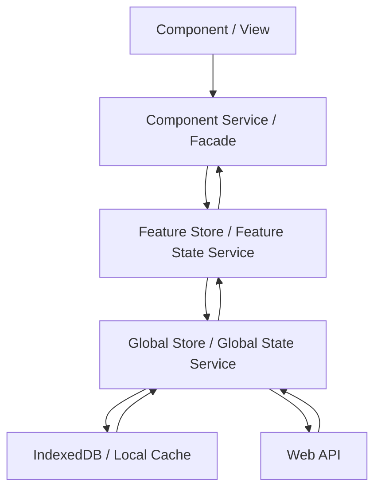

# DEVELOPER.Angular.md

Stand: 2026-05-13

## Zweck

Diese Datei definiert Angular-spezifische Entwicklungsregeln dieses Repositories. Allgemeine Regeln stehen in `DEVELOPER.md`. Sie gilt fuer Angular-Anwendungen und Angular-nahe Frontend-Teile mit Routing, UI, State, Formularen, Datenzugriff und optionaler Offline-Faehigkeit.

[PRIORITY] Diese Regeln gelten in ihrem Scope vorrangig vor allgemeineren Regeln aus `DEVELOPER.md`.

## Versionsbasis

[MUST] Angular-Implementierungen muessen zu den im Projekt wirklich eingesetzten Versionen passen.

Aktuell verwendet das Repository:

- Angular `21.2.0` fuer `@angular/common`, `@angular/compiler`, `@angular/core`, `@angular/forms`, `@angular/platform-browser`, `@angular/router`
- Angular CLI und Build `21.2.10`
- TypeScript `5.9.2`
- RxJS `7.8.0`
- Standalone-Bootstrap mit `app.config.ts` und `app.routes.ts`
- SCSS als Standard fuer Component-Styling

[MUST] Abweichungen oder Upgrades muessen als eigenes technisches Thema behandelt werden.

[MUST_NOT] Abweichungen oder Upgrades duerfen nicht implizit innerhalb fachlicher Aenderungen mitgezogen werden.

## Zielbild

[MUST] Angular-Anwendungen muessen als reaktive, modulare Anwendungen gebaut werden.

[MUST] Komponenten muessen Daten anzeigen und Nutzerintentionen senden.

[MUST] Feature-State, Datenzugriff, lokale Persistenz und Hintergrundarbeit muessen ausserhalb der Komponenten liegen.



## Standardstruktur

[SHOULD] Angular-Projekte sollen der folgenden Struktur folgen. Abweichungen sind erlaubt, wenn ein bestehendes Projekt eine andere stabile Struktur vorgibt und die konkrete Aufgabe keine Strukturmigration ist.

```text
src/app/
  core/
    auth/
    config/
    data-access/
    enums/
    guards/
    interfaces/
    layout/
    models/
    resolvers/
    services/
    state/
    util/
  shared/
    ui/
    util/
    pipes/
  features/
    <feature>/
      pages/
      components/
      models/
      services/
      store/
      util/
  app.routes.ts
  app.config.ts
```

[MUST] `src/app/core/` muss Singleton-nahe Infrastruktur wie Auth, Konfiguration, globale Services, State und Layout enthalten.

[MUST] `src/app/shared/` muss wiederverwendbare, fachlich neutrale UI-Bausteine und Hilfen enthalten.

[MUST] `src/app/features/` muss fachliche Features enthalten.

[MUST] Feature-Ordner muessen UI, Logik und lokale Modelle eines Features kapseln.

[MUST] `src/app/app.routes.ts` muss die Routen der Anwendung definieren.

[MUST] `src/app/app.config.ts` muss Bootstrap und globale Provider definieren.

[SHOULD] Standalone Components, `app.config.ts` und funktionale Provider sollen verwendet werden. Abweichungen sind erlaubt, wenn Legacy-Integration oder Bibliotheken `NgModule` erfordern.

## View-Regeln

[MUST] Components und Views muessen duenn bleiben.

[ALLOW] Komponenten duerfen Template-Zustand, Eingabe-/Ausgabe-Bindings und kleine UI-Entscheidungen enthalten.

[MUST] Komponenten muessen fachliche Aktionen an Facades, Component Services oder Use Cases delegieren.

[MUST_NOT] Komponenten duerfen Web APIs, IndexedDB, LocalStorage, Worker oder globale Stores nicht direkt aufrufen.

[MUST] Smart Components muessen mit einer Feature-Facade oder einem Component Service sprechen.

[SHOULD] Presentational Components sollen frei von fachlicher Orchestrierung bleiben. Abweichungen sind erlaubt, wenn eine sehr kleine Komponente eine lokale, rein visuelle Entscheidung kapselt.

## Templates und Component-Markup

[MUST] Angular-Templates müssen schlank, lesbar und deklarativ bleiben.

[MUST] Templates dürfen sichtbare Zustände rendern, Nutzeraktionen binden und einfache UI-Verzweigungen enthalten.

[MUST_NOT] Templates dürfen keine fachliche Orchestrierung, komplexe Berechnungen, Datenmapping, Filterlogik oder technische Ablaufsteuerung enthalten.

[MUST] Wiederholte oder komplexe Template-Ausdrücke müssen in `computed`, klar benannte readonly Properties oder View-Modelle ausgelagert werden.

[MUST_NOT] Methodenaufrufe im Template dürfen Seiteneffekte, Datenzugriffe, Mutationen, teure Berechnungen oder asynchrone Operationen auslösen.

[MUST] Kontrollfluss im Template muss nachvollziehbar bleiben.

[SHOULD] Mehrfach verschachtelte `@if`, `@for` oder `ng-template`-Strukturen sollen durch kleinere Presentational Components, benannte computed Values oder View-Modelle vereinfacht werden.

[MUST] Jede neue DOM-Ebene muss einen klaren Zweck haben: Semantik, Layout, Zustand, Wiederverwendung oder Accessibility.

[MUST_NOT] Neue Wrapper-Elemente dürfen eingeführt werden, wenn sie keinen klaren Zweck erfüllen.

[MUST] Listen müssen stabile fachliche `track`-Ausdrücke verwenden.

[MUST_NOT] Array-Index darf nicht als `track` verwendet werden, wenn fachliche IDs oder stabile Schlüssel verfügbar sind.

[MUST] Bedingte Darstellung muss alle relevanten Nutzerzustände abdecken, sofern diese im Flow auftreten können: Laden, leerer Zustand, Fehler, nicht erlaubt, nicht verfügbar und regulärer Inhalt.

## Styling, UI und Accessibility

[MUST_NOT] Designsysteme und Komponentenbibliotheken dürfen nicht ohne ausdrückliche User-Anweisung installiert werden.

[MUST] Bestehende UI-Konventionen des Projekts müssen vor neuen Styling-Konzepten verwendet werden.

[MUST] Component-SCSS muss lokal, begrenzt und komponentennah bleiben.

[MUST_NOT] Component-SCSS darf keine globalen Seiteneffekte erzeugen.

[MUST_NOT] Globale Styles dürfen nicht für lokale Component-Probleme erweitert werden.

[MUST_NOT] Inline-Styles dürfen nicht verwendet werden, außer für dynamische Werte, die nicht sinnvoll über Klassen oder CSS Custom Properties abbildbar sind.

[MUST] Layout muss mit möglichst wenigen DOM-Ebenen und klaren Verantwortlichkeiten umgesetzt werden.

[MUST_NOT] Styling-Änderungen dürfen keine ungenutzten Klassen, doppelten Regeln oder widersprüchlichen Layout-Mechanismen einführen.

[MUST] Spacing, Typografie, Farben, Radius, Schatten und Breakpoints müssen bestehenden Projektkonventionen folgen.

[MUST_NOT] Magic Numbers in CSS dürfen nicht eingeführt werden, wenn bestehende Tokens, Variablen oder Konventionen vorhanden sind.

[MUST] Responsive Verhalten muss bei layoutrelevanten Änderungen berücksichtigt werden.

[MUST] Accessibility ist Teil der Definition of Done: Labels, Tastaturbedienung, Fokusführung, Kontraste und semantische Elemente müssen berücksichtigt werden.

[MUST] Interaktive Elemente müssen als passende semantische Elemente umgesetzt werden, z. B. `button` für Aktionen und `a` für Navigation.

[MUST_NOT] Klickbare `div`- oder `span`-Elemente dürfen nicht eingeführt werden, wenn ein semantisches Element verwendet werden kann.

[MUST] Formularfelder müssen programmatisch erkennbare Labels, Fehlermeldungen und Hilfetexte haben.

[MUST] Fokuszustand, Disabled-Zustand, Loading-Zustand und Fehlerzustand müssen visuell und semantisch nachvollziehbar sein.

[MUST] UI-Texte müssen fachlich präzise sein.

[MUST_NOT] Technische Erklärtexte und Metadaten dürfen nicht als sichtbare UI-Texte erscheinen.

## UI-Änderungen durch Agents

[MUST] UI-Änderungen müssen bevorzugt bestehende Strukturen vereinfachen, statt neue Wrapper, Sonderfälle oder Styling-Schichten hinzuzufügen.

[MUST] Vor neuen Komponenten, Klassen oder Utilities muss geprüft werden, ob im Projekt bereits ein passendes Pattern existiert.

[MUST_NOT] Agents dürfen UI-Code nicht nur lokal reparieren, wenn dadurch globale Inkonsistenz, doppelte Layoutlogik oder CSS-Wildwuchs entsteht.

[MUST] Bei UI-Refactorings muss das sichtbare Verhalten erhalten bleiben, sofern die Aufgabe keine fachliche oder visuelle Änderung verlangt.

[MUST] Der Arbeitsabschluss muss bei UI-Änderungen nennen:
- welche sichtbaren Zustände betroffen sind,
- ob Markup vereinfacht oder erweitert wurde,
- ob Accessibility betroffen ist,
- welche Tests oder manuellen Checks ausgeführt oder ausgelassen wurden.

[MUST_IF] Screenshots, Storybook, Playwright oder vergleichbare visuelle Checks müssen genutzt werden, wenn die Änderung Layout, Responsiveness, Accessibility oder sichtbare Nutzerflows betrifft und diese Werkzeuge im Projekt verfügbar sind.

## State-Regeln

[SHOULD] Signals sollen fuer synchronen UI-State verwendet werden. Abweichungen sind erlaubt, wenn Angular APIs oder externe Bibliotheken Observables vorgeben oder erwarten.

[MUST] Oeffentliche State-Reads muessen readonly oder ueber klar benannte Selector-Methoden angeboten werden.

[ALLOW_IF] State darf geaendert werden, wenn die Aenderung ueber explizite Methoden erfolgt.

[MUST] Abgeleiteter State muss berechnet werden.

[MUST_NOT] Abgeleiteter State darf nicht redundant gespeichert werden.

[MUST_NOT] RxJS darf nicht als Anwendungs-State- oder Datenfluss-Primitive verwendet werden.

[ALLOW_IF] Angular-/RxJS-Interop darf genutzt werden, wenn Angular APIs oder externe Bibliotheken Observables vorgeben oder erwarten.

## Datenfluss

[MUST] Nutzeraktionen in der View muessen Methoden der Facade oder des Component Service aufrufen.

[MUST] Facade, Store oder Application Service muessen Validierung, Datenzugriff, lokale Persistenz und Worker-Aufgaben koordinieren.

[ALLOW_IF] Die View darf Aenderungen erhalten, wenn sie ueber Signals, Computed Values oder klar benannte Read-APIs bereitgestellt werden.

[MUST_NOT] Direkte Kurzschluesse wie Component -> Web API, Component -> Local Storage oder Component -> globaler App-State duerfen nicht eingefuehrt werden.

## Lokale Daten und Offline-Faehigkeit

[MUST] IndexedDB und LocalStorage muessen ueber Adapter oder Repository-Services gekapselt werden.

[MUST] Offline- und Sync-Zustaende muessen explizit modelliert werden, z. B. `idle`, `loading`, `synced`, `dirty`, `conflict`, `failed`.

[MUST_IF] Cache-Invalidierung, TTL, Konfliktloesung und manuelles Refresh-Verhalten muessen fachlich geregelt und getestet werden, wenn lokale Daten oder Offline-Faehigkeit Teil des Tasks sind.

## Web API und Worker

[MUST] HTTP-Zugriff muss in `core/data-access/` liegen.

[MUST_NOT] Komponenten duerfen HTTP-Zugriff nicht direkt enthalten.

[MUST] Fuer HTTP Requests muss `Promise<T>` oder `Promise` verwendet werden.

[MUST] DTOs muessen an der Grenze in fachliche View- oder Domain-Modelle gemappt werden.

[MUST_IF] Interceptors muessen Auth, Correlation IDs, Retry fuer idempotente Requests und technische Fehlerklassen behandeln, wenn diese Querschnittsthemen im Projekt benoetigt werden.

[MUST] Cancellation muss fuer Requests, Worker-Jobs und laengere Streams vorgesehen werden.

## Forms und Validierung

[SHOULD] Signal Forms sollen verwendet werden, wenn die verwendete Angular-Version und das Projektsetup sie ohne experimentelle Flags, bekannte Blocker oder inkompatible Bibliotheken unterstuetzen.

[MUST] Fachliche Validierung muss wiederverwendbar sein.

[MUST] Geteilte fachliche Validierung muss in `shared/util` liegen.

[MUST] Formularzustaende wie `dirty`, `pending`, `invalid`, `saving` und `saved` muessen explizit behandelt werden.

## Styling, UI und Accessibility

[MUST_NOT] Designsysteme und Komponentenbibliotheken duerfen nicht ohne ausdrueckliche User-Anweisung installiert werden.

[MUST] Accessibility ist Teil der Definition of Done: Labels, Tastaturbedienung, Fokusfuehrung, Kontraste und semantische Elemente muessen beruecksichtigt werden.

[MUST] UI-Texte muessen fachlich praezise sein.

[MUST_NOT] Technische Erklaertexte und Metadaten duerfen nicht als sichtbare UI-Texte erscheinen.

## Unit Tests und E2E

[MUST_IF] Unit Tests muessen Stores, Services, Guards, Resolver, Pipes und fachliche Hilfsfunktionen absichern, wenn diese im Task geaendert oder neu erstellt werden.

[SHOULD] E2E-Tests sollen mit Playwright kritische Nutzerfluesse abdecken. Abweichungen sind erlaubt, wenn das Projekt einen anderen E2E-Runner vorgibt oder der Task keinen sichtbaren Nutzerflow betrifft.

[MUST] Tests muessen sichtbares Verhalten und fachliche Zustaende pruefen.

[MUST_NOT] Tests duerfen private Implementierungsdetails nicht als primaeren Vertrag pruefen.

[SHOULD] Playwright-Tests sollen nutzerorientierte Selektoren wie `getByRole`, `getByLabel` und `getByText` verwenden. Abweichungen sind erlaubt, wenn Framework-Markup keine robuste semantische Auswahl ermoeglicht.

[ALLOW_IF] `data-testid` darf eingesetzt werden, wenn semantische Selektoren durch Framework-Markup nicht robust genug sind.

[MUST_NOT] Feste Wartezeiten wie `waitForTimeout` duerfen nicht verwendet werden.

[MUST] Tests muessen auf sichtbare Nutzerzustaende, URLs oder Rollen warten.

[MUST] E2E-Testfaelle muessen klein und klar benannt bleiben.

[MUST_NOT] Grosse Sammeltests duerfen nicht eingefuehrt werden.

## Qualitaet und Code

[MUST] TypeScript `strict` muss aktiviert bleiben.

[ALLOW_IF] `any` darf nur an technischen Grenzen mit begruendeter Kapselung verwendet werden.

[MUST] TypeScript-Modelle, DTOs und Objektvertraege muessen standardmaessig als `type` definiert werden.

[MUST_NOT] TypeScript-Modelle, DTOs und Objektvertraege duerfen nicht ohne technischen Grund als `interface` definiert werden.

[MUST] Die `type`-Konvention muss ueber `@typescript-eslint/consistent-type-definitions` erzwungen werden.

[ALLOW_IF] Abweichungen von der `type`-Konvention sind erlaubt, wenn ein technischer Grund vorliegt und das aktive Lint-Regelwerk die Abweichung erlaubt.

[MUST_NOT] Zirkulaere Feature-Abhaengigkeiten duerfen nicht eingefuehrt werden.

[MUST] Environment-spezifische Werte muessen ueber Konfiguration bereitgestellt werden.

[MUST_NOT] Environment-spezifische Werte duerfen nicht hart codiert werden.
