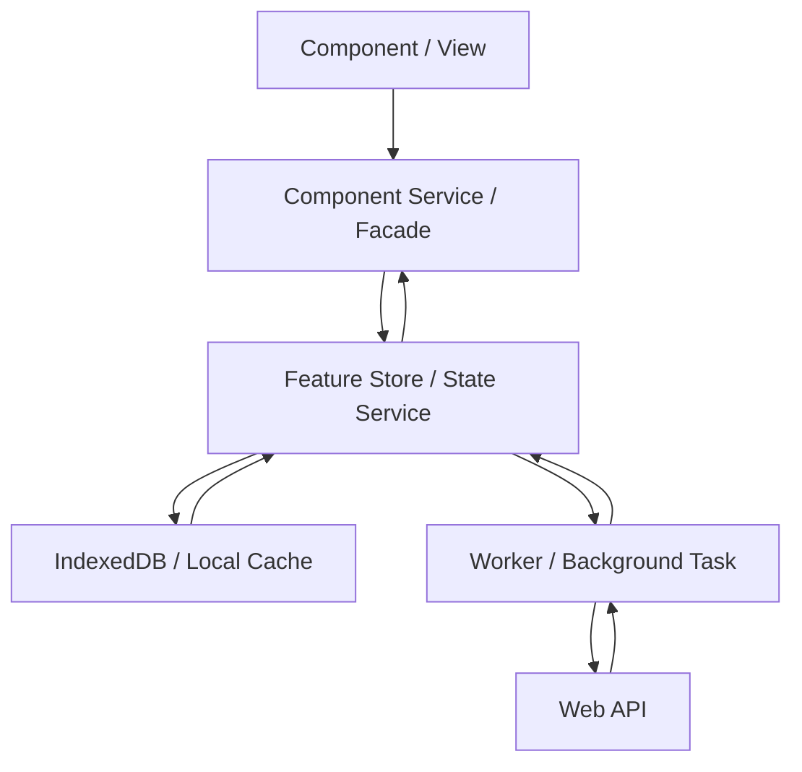

# Architecture.Angular.md

Stand: 2026-04-30

## Versionsbasis

Diese Datei enthält eine Momentaufnahme der empfohlenen Plattformversionen. Die Angaben müssen beim Einsatz in einem Repository und vor jedem Major Upgrade gegen die offiziellen Release- und Kompatibilitätsseiten geprüft werden.

Nach offizieller Angular-Dokumentation ist Angular `^21.0.0` aktuell aktiv unterstützt. Angular `^20.0.0` und `^19.0.0` sind noch in LTS; Angular `v22.0` ist für die Woche ab 2026-06-01 angekündigt. Für Angular 21 gelten laut Kompatibilitätstabelle Node.js `^20.19.0 || ^22.12.0 || ^24.0.0`, TypeScript `>=5.9.0 <6.0.0` und RxJS `^6.5.3 || ^7.4.0`.

Angular-Projekte verwenden die neueste stabile, aktiv unterstützte Angular-Major-Version, sofern `agents/Repository.md` nichts anderes festlegt. Vor Scaffold, Major Upgrade oder Toolchain-Wechsel werden `https://angular.dev/reference/releases` und `https://angular.dev/reference/versions` geprüft.

Repository-spezifisch verbindlich sind die Versionen in:

- `package.json`
- `package-lock.json`, `pnpm-lock.yaml`, `yarn.lock` oder anderer Lockfile
- `.nvmrc` oder `.node-version`
- Angular-/TypeScript-Konfiguration
- CI-Konfiguration
- `agents/Repository.md`

## Zielbild

Angular-Anwendungen werden als reaktive, modulare Anwendungen gebaut. Komponenten zeigen Daten an und senden Nutzerintentionen. Feature-State, Datenzugriff, lokale Persistenz und Hintergrundarbeit liegen außerhalb der Komponenten.



## Skalierung der Architektur

Diese Struktur ist ein Zielbild für wartbare Anwendungen. Kleine Features müssen nicht alle Ordner und Patterns enthalten.

Ein eigener Store, Worker, IndexedDB-Adapter oder zusätzliche Facade wird erst eingeführt, wenn Zustand, Nebenläufigkeit, Offline-Fähigkeit, Performance oder Testbarkeit davon profitieren.

## Standardstruktur

```text
src/app/
  core/
    auth/
    http/
    config/
    layout/
  shared/
    ui/
    util/
    pipes/
  features/
    <feature>/
      pages/
      components/
      state/
      data-access/
      models/
      util/
  app.routes.ts
  app.config.ts
```

- `core/` enthält Singleton-nahe Infrastruktur wie Auth, globale Interceptors, App-Konfiguration und Shell/Layout.
- `shared/` enthält wiederverwendbare, fachlich neutrale UI-Bausteine und Hilfen.
- `features/<feature>/` kapselt fachliche Use Cases inklusive State, Datenzugriff und UI.
- `pages/` enthalten routennahe Smart Components.
- `components/` enthalten presentational Components und featurelokale UI-Bausteine.
- `state/` enthält Feature Store, Facade, Commands, Selectors und abgeleiteten State.
- `data-access/` enthält API-Clients, IndexedDB-Adapter, DTOs und Mapper.
- `models/` enthält fachliche View-/Feature-Modelle, keine rohen API-DTOs.
- Standalone Components, `app.config.ts` und funktionale Provider sind Standard. NgModules werden nur für Legacy-Integration oder Bibliotheken genutzt, die sie erfordern.

## View-Regeln

- Komponenten enthalten Template-Zustand, Eingabe-/Ausgabe-Bindings und kleine UI-Entscheidungen.
- Komponenten rufen keine Web APIs, IndexedDB, LocalStorage, Worker oder globalen Stores direkt auf.
- Smart Components sprechen mit einer Feature-Facade oder einem Component Service.
- Presentational Components sind möglichst rein: Inputs, Outputs, keine fachliche Orchestrierung.
- Templates bleiben lesbar. Komplexe Bedingungen, Mapping, Sortierung und Formatierung wandern in Signals, Computed Values, Pipes oder Services.
- `ChangeDetectionStrategy.OnPush` ist Standard, sofern die Angular-Version bzw. das lokale Setup nichts anderes vorgibt.
- Listen verwenden stabile Identitäten über `track` bzw. `trackBy`.
- Komponenten-APIs sind klein und fachlich benannt. Inputs sind bevorzugt immutable.

## State-Regeln

- Feature-State wird pro Feature in einem Store oder State Service gekapselt.
- Signals sind die bevorzugte Primitive für synchronen UI-State. Öffentliche State-Reads werden als readonly Signals, Computed Signals oder klar benannte Selector-Methoden angeboten.
- State wird nur über explizite Methoden geändert, zum Beispiel `loadBuildings()`, `selectBuilding(id)` oder `updateFilter(filter)`.
- Komponenten mutieren keine Store-Interna.
- RxJS bleibt für Streams, HTTP, WebSocket, Events, Debounce, Retry und Cancellation relevant. Signals und Observables werden bewusst an Schichtgrenzen verbunden.
- Abgeleiteter State wird berechnet, nicht redundant gespeichert.
- Lade-, Fehler- und Empty-States sind Teil des State-Modells.
- Store-Methoden sind idempotent, wenn sie durch Routing, Retry oder erneute Nutzeraktion mehrfach ausgelöst werden können.

## Datenfluss

- Nutzeraktion in der View ruft eine Methode der Facade oder des Component Service auf.
- Die Facade validiert UI-nahe Eingaben und ruft Store-Commands oder Application Services.
- Der Store setzt Lade-/Fehlerzustand und startet Datenzugriff oder Worker-Aufgaben.
- API-Antworten und lokale Persistenz-Änderungen laufen zurück in den Store.
- Die View erhält Änderungen ausschließlich über Signals, Computed Values oder Observables aus der Facade.
- Datenfluss bleibt einseitig. Rückkopplungen zwischen Komponenten werden über State, Router oder explizite Outputs modelliert.

## Lokale Daten und Offline-Fähigkeit

- IndexedDB wird über einen klaren Adapter oder Repository-Service gekapselt.
- Der Store entscheidet, wann lokale Daten gelesen oder geschrieben werden.
- Komponenten und Worker greifen nicht direkt auf dieselben IndexedDB-Tabellen zu, ohne dass der Store die Konsistenzregeln vorgibt.
- Bei Offline-/Sync-Fähigkeit gibt es explizite Sync-Zustände: `idle`, `loading`, `synced`, `dirty`, `conflict`, `failed`.
- Konflikte zwischen lokaler Änderung und Serverantwort werden fachlich gelöst und getestet.
- Persistierte Daten haben eine Version, wenn Migrationen oder Schema-Änderungen realistisch sind.
- Cache-Invalidierung, TTL und manuelles Refresh-Verhalten sind dokumentiert oder im Code klar erkennbar.

## Web API und Worker

- HTTP-Zugriff liegt in `data-access/` oder `core/http/`, nicht in Komponenten.
- DTOs werden typisiert und an der Grenze in fachliche View- oder Domain-Modelle gemappt.
- Interceptors behandeln Auth, Correlation IDs, Retry für idempotente Requests und technische Fehlerklassen.
- Web Worker werden für CPU-intensive Arbeit, große Datenmengen, Geometrie, Parsing oder lange Hintergrundprozesse genutzt.
- Worker-Kommunikation verwendet typisierte Message Contracts.
- Polling wird zentral gesteuert und beendet, wenn die Anwendung offline ist, der Nutzer abgemeldet ist oder das Feature nicht aktiv ist.
- Cancellation ist für Requests, Worker-Jobs und längere Streams vorgesehen.

## Routing, Auth und Berechtigungen

- Feature-Routen werden lazy geladen, wenn das Feature nicht immer benötigt wird.
- Guards schützen Zugriff, Resolver werden nur genutzt, wenn sie Navigation wirklich verbessern.
- Berechtigungslogik liegt nicht verstreut im Template. Sie wird über zentrale Services, Directives oder Facade-State bereitgestellt.
- Route Params werden validiert und in fachliche IDs/Filter übersetzt.
- Deep Links sind stabile Verträge für fachlich relevante Ansichten.

## Forms und Validierung

- Reactive Forms sind Standard für komplexe Formulare.
- Form-Modelle sind typisiert.
- Fachliche Validierung liegt nicht nur im Template. Wiederverwendbare Validatoren liegen beim Feature oder in `shared/util`.
- Serverfehler werden in fachliche, nutzbare Formfehler übersetzt.
- Speichern ist gegen Mehrfachklicks, veraltete Daten und konkurrierende Requests geschützt.
- Formularzustände wie `dirty`, `pending`, `invalid`, `saving` und `saved` werden explizit behandelt.

## Styling, UI und Accessibility

- Ein Designsystem oder eine lokale Komponentenbibliothek wird bevorzugt gegenüber uneinheitlichen Einzellösungen.
- Accessibility ist Teil der Definition of Done: Labels, Tastaturbedienung, Fokusführung, Kontraste und semantische Elemente.
- Responsiveness wird in Komponenten und Layouts aktiv berücksichtigt.
- UI-Texte sind fachlich präzise und werden nicht als technische Erklärtexte missbraucht.
- Wiederverwendbare UI-Komponenten kapseln Verhalten, aber keine Feature-Fachlogik.
- ARIA wird gezielt eingesetzt, wenn semantisches HTML allein nicht reicht.

## Performance

- Lazy Loading, Deferrable Views und Code Splitting werden für schwere Features und selten genutzte Bereiche verwendet.
- Große Listen nutzen Pagination, Virtual Scroll oder serverseitige Filterung.
- Teure Berechnungen liegen in Computed Signals, memoisierten Selectors oder Worker-Jobs.
- Bundle-Größe und Initial Load werden bei neuen Abhängigkeiten berücksichtigt.
- `shareReplay` wird nur mit bewusstem Cache-Verhalten und Fehlerstrategie eingesetzt.
- Memory Leaks werden durch `async` Pipe, Signals, `takeUntilDestroyed` oder klare Lifecycle-Verwaltung vermieden.

## Unit Tests und E2E

- Store-Tests prüfen Initial State, Commands, abgeleiteten State, Lade-/Fehlerzustände und Seiteneffekte mit Fakes.
- Component-Tests prüfen Rendering, Inputs/Outputs und Nutzerinteraktion ohne echte APIs.
- Data-Access-Tests prüfen URLs, Parameter, Header, Mapping, Retry und Fehlerübersetzung mit HTTP-Testwerkzeugen.
- IndexedDB-Adapter werden mit isolierten Testdatenbanken oder Fakes getestet.
- Worker-Protokolle werden über Message Contracts und Beispielnachrichten getestet.
- E2E-Tests, bevorzugt Playwright, decken kritische Nutzerflüsse ab.
- Tests prüfen sichtbares Verhalten und fachliche Zustände, nicht private Implementierungsdetails.

## Qualitätsregeln

- TypeScript `strict` ist Pflicht.
- Kein `any`, außer an technischen Grenzen mit begründeter Kapselung.
- Keine zirkulären Feature-Abhängigkeiten.
- Environment-spezifische Werte werden über Konfiguration bereitgestellt, nicht hart codiert.
- Öffentliche Component-, Store- und Service-APIs bleiben klein.
- Generierte Dateien, Build-Artefakte und lokale Caches werden nicht als Architekturquelle verwendet.
