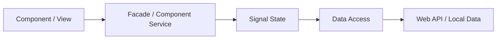

# DEVELOPER.Angular.md

Stand: 2026-05-01

## Zweck

Diese Datei definiert die Angular-spezifischen Entwicklungsregeln dieses Repositories. Allgemeine Regeln stehen in `DEVELOPER.md`. Sie gilt fuer Angular-Anwendungen und Angular-nahe Frontend-Teile mit Routing, UI, State, Formularen, Datenzugriff und optionaler Offline-Faehigkeit.

## Versionsbasis

Angular-Projekte verwenden die neueste stabile, aktiv unterstuetzte Angular-Major-Version.

Nach offizieller Angular-Dokumentation ist Angular `^21.0.0` aktuell aktiv unterstuetzt. Angular `^20.0.0` und `^19.0.0` sind noch in LTS; Angular `v22.0` ist fuer die Woche ab 2026-06-01 angekuendigt. Fuer Angular 21 gelten laut Kompatibilitaetstabelle Node.js `^20.19.0 || ^22.12.0 || ^24.0.0`, TypeScript `>=5.9.0 <6.0.0` und RxJS `^6.5.3 || ^7.4.0`.

## Zielbild

Angular-Anwendungen werden als reaktive, modulare Anwendungen gebaut. Komponenten zeigen Daten an und senden Nutzerintentionen. Feature-State, Datenzugriff, lokale Persistenz und Hintergrundarbeit liegen ausserhalb der Komponenten.



## Standardstruktur

```text
src/app/
  core/
    auth/
    config/
    data-access/
    enums/
    guards/
    interfaces/
    layout/
    models/
    resolvers/
    services/
    state/
    util/
  shared/
    ui/
    util/
    pipes/
  features/
    <feature>/
      pages/
      components/
      models/
      services/
      util/
  app.routes.ts
  app.config.ts
```

| Pfad | Bereich | Zweck |
|---|---|---|
| `src/app/core/` | `core` | Singleton-nahe Infrastruktur wie Auth, Konfiguration, globale Services, State und Layout. |
| `src/app/core/auth/` | `core` | Enthaelt Authentifizierung und Autorisierung. |
| `src/app/core/config/` | `core` | Enthaelt App-Konfiguration und zugehoerige Typen. |
| `src/app/core/data-access/` | `core` | Enthaelt API-Clients und technische Datenzugriffe. |
| `src/app/core/enums/` | `core` | Enthaelt zentrale Enums. |
| `src/app/core/guards/` | `core` | Enthaelt Route Guards und Zugriffsschutz. |
| `src/app/core/interfaces/` | `core` | Enthaelt zentrale Vertraege und Schnittstellen. |
| `src/app/core/layout/` | `core` | Enthaelt Shell, Layout und Rahmenelemente. |
| `src/app/core/models/` | `core` | Enthaelt zentrale Modelle, keine rohen API-DTOs. |
| `src/app/core/resolvers/` | `core` | Enthaelt Route Resolver. |
| `src/app/core/services/` | `core` | Enthaelt globale Services. |
| `src/app/core/state/` | `core` | Enthaelt App Store, Feature Store, Facade, Commands und Selectors. |
| `src/app/core/util/` | `core` | Enthaelt zentrale Hilfen. |
| `src/app/shared/` | `shared` | Wiederverwendbare, fachlich neutrale UI-Bausteine und Hilfen. |
| `src/app/shared/ui/` | `shared` | Enthaelt wiederverwendbare UI-Komponenten. |
| `src/app/shared/util/` | `shared` | Enthaelt wiederverwendbare Hilfsfunktionen. |
| `src/app/shared/pipes/` | `shared` | Enthaelt wiederverwendbare Pipes. |
| `src/app/features/` | `feature` | Enthaelt alle fachlichen Features. |
| `src/app/features/<feature>/` | `feature` | Kapselt ein Feature mit UI, Logik und lokalen Modellen. |
| `src/app/features/<feature>/pages/` | `feature` | Enthaelt die Einstiegs-Components eines Features pro Route. |
| `src/app/features/<feature>/components/` | `feature` | Enthaelt featurelokale UI-Bausteine und presentational Components. |
| `src/app/features/<feature>/models/` | `feature` | Enthaelt featurelokale Modelle. |
| `src/app/features/<feature>/services/` | `feature` | Enthaelt featurelokale Services. |
| `src/app/features/<feature>/util/` | `feature` | Enthaelt featurelokale Hilfen. |
| `src/app/app.routes.ts` | `allgemein` | Definiert die Routen der Anwendung. |
| `src/app/app.config.ts` | `allgemein` | Definiert Bootstrap und globale Provider. |

Standalone Components, `app.config.ts` und funktionale Provider sind Standard. NgModules werden nur fuer Legacy-Integration oder Bibliotheken genutzt, die sie erfordern.

## View-Regeln

- Komponenten enthalten Template-Zustand, Eingabe-/Ausgabe-Bindings und kleine UI-Entscheidungen.
- Komponenten rufen keine Web APIs, IndexedDB, LocalStorage, Worker oder globalen Stores direkt auf.
- Smart Components sprechen mit einer Feature-Facade oder einem Component Service; presentational Components bleiben moeglichst rein.

## State-Regeln

- Signals sind die bevorzugte Primitive fuer synchronen UI-State; oeffentliche State-Reads werden readonly oder ueber klar benannte Selector-Methoden angeboten.
- State wird nur ueber explizite Methoden geaendert und abgeleiteter State wird berechnet, nicht redundant gespeichert.
- RxJS wird nicht als Anwendungs-State- oder Datenfluss-Primitive verwendet. Erlaubt ist nur Angular-/RxJS-Interop, wenn Angular APIs oder externe Bibliotheken Observables vorgeben oder erwarten.

## Datenfluss

- Nutzeraktionen in der View rufen Methoden der Facade oder des Component Service auf.
- Facade, Store oder Application Service koordinieren Validierung, Datenzugriff, lokale Persistenz und Worker-Aufgaben.
- Die View erhaelt Aenderungen ausschliesslich ueber Signals, Computed Values oder klar benannte Read-APIs.

## Lokale Daten und Offline-Faehigkeit

- IndexedDB und LocalStorage werden ueber Adapter oder Repository-Services gekapselt.
- Offline- und Sync-Zustaende werden explizit modelliert, z. B. `idle`, `loading`, `synced`, `dirty`, `conflict`, `failed`.
- Cache-Invalidierung, TTL, Konfliktloesung und manuelles Refresh-Verhalten sind fachlich geregelt und getestet.

## Web API und Worker

- HTTP-Zugriff liegt in `core/data-access/`, nicht in Komponenten.
- Fuer HTTP Requests wird `Promise<T>` oder `Promise` verwendet; DTOs werden an der Grenze in fachliche View- oder Domain-Modelle gemappt.
- Interceptors behandeln Auth, Correlation IDs, Retry fuer idempotente Requests und technische Fehlerklassen; Cancellation ist fuer Requests, Worker-Jobs und laengere Streams vorgesehen.

## Forms und Validierung

- Signal Forms sind bevorzugt, wenn die verwendete Angular-Version und das Projektsetup sie stabil genug unterstuetzen.
- Fachliche Validierung ist wiederverwendbar und liegt fuer geteilte Faelle in `shared/util`.
- Formularzustaende wie `dirty`, `pending`, `invalid`, `saving` und `saved` werden explizit behandelt.

## Styling, UI und Accessibility

- Designsysteme und Komponentenbibliotheken werden nicht eigenstaendig installiert, ausser es wird ausdruecklich erwuenscht.
- Accessibility ist Teil der Definition of Done: Labels, Tastaturbedienung, Fokusfuehrung, Kontraste und semantische Elemente.
- UI-Texte sind fachlich praezise; technische Erklaertexte werden vermieden.

## Unit Tests und E2E

- Unit Tests sichern Stores, Services, Guards, Resolver, Pipes und fachliche Hilfsfunktionen ab.
- E2E-Tests, bevorzugt Playwright, decken kritische Nutzerfluesse ab.
- Tests pruefen sichtbares Verhalten und fachliche Zustaende, nicht private Implementierungsdetails.

## Qualitaet und Code

- TypeScript `strict` ist Pflicht; `any` ist nur an technischen Grenzen mit begruendeter Kapselung erlaubt.
- Ein DTO bzw. ein Model in einem der `models/` Ordner wird bevorzugt als `type` definiert, nicht als `interface`.
- Keine zirkulaeren Feature-Abhaengigkeiten; environment-spezifische Werte werden ueber Konfiguration bereitgestellt, nicht hart codiert.

