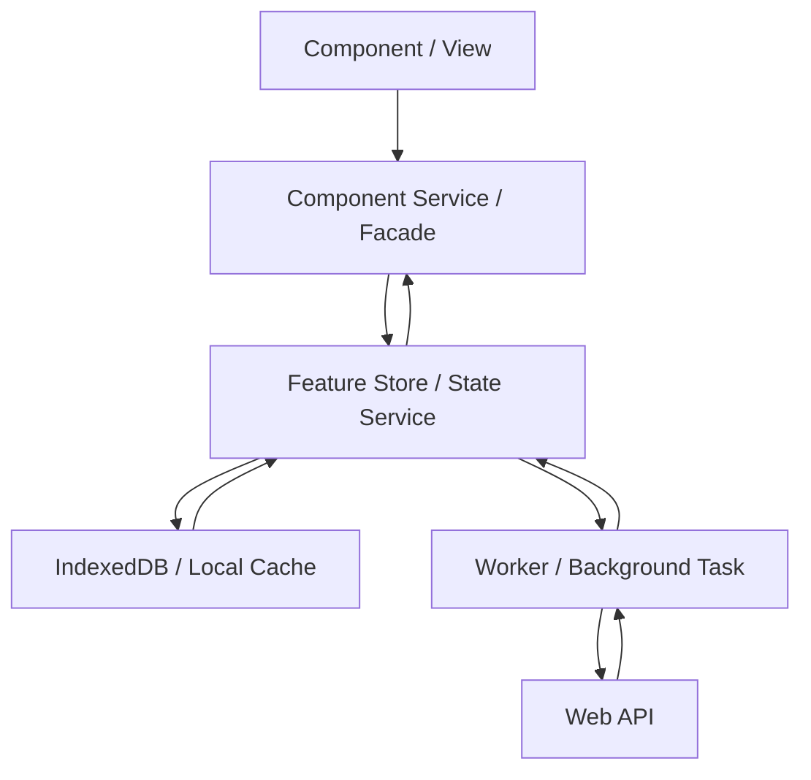

# DEVELOPER.Angular.md

Stand: 2026-04-30

## Zweck

Diese Datei definiert die Angular-spezifischen Entwicklungsregeln dieses Repositories. Allgemeine Regeln stehen in `DEVELOPER.md`.

## Versionsbasis

Nach offizieller Angular-Dokumentation ist Angular `^21.0.0` aktuell aktiv unterstützt. Angular `^20.0.0` und `^19.0.0` sind noch in LTS; Angular `v22.0` ist für die Woche ab 2026-06-01 angekündigt. Für Angular 21 gelten laut Kompatibilitätstabelle Node.js `^20.19.0 || ^22.12.0 || ^24.0.0`, TypeScript `>=5.9.0 <6.0.0` und RxJS `^6.5.3 || ^7.4.0`.

Angular-Projekte verwenden die neueste stabile, aktiv unterstützte Angular-Major-Version.

## Zielbild

Angular-Anwendungen werden als reaktive, modulare Anwendungen gebaut. Komponenten zeigen Daten an und senden Nutzerintentionen. Feature-State, Datenzugriff, lokale Persistenz und Hintergrundarbeit liegen außerhalb der Komponenten.



## Standardstruktur

```text
src/app/
  core/
    auth/
    config/
    data-access/
    enums/
    guards/
    interfaces/
    layout/
    models/
    resolvers/
    services/
    state/
    util/
  shared/
    ui/
    util/
    pipes/
  features/
    <feature>/
      pages/
      components/
      models/
      services/
      util/
  app.routes.ts
  app.config.ts
```

| Pfad | Bereich | Zweck |
|---|---|---|
| `src/app/core/` | `core` | Singleton-nahe Infrastruktur wie Auth, Konfiguration, globale Services, State und Layout. |
| `src/app/core/auth/` | `core` | Enthält Authentifizierung und Autorisierung. |
| `src/app/core/config/` | `core` | Enthält App-Konfiguration und zugehörige Typen. |
| `src/app/core/data-access/` | `core` | Enthält API-Clients und technische Datenzugriffe. |
| `src/app/core/enums/` | `core` | Enthält zentrale Enums. |
| `src/app/core/guards/` | `core` | Enthält Route Guards und Zugriffsschutz. |
| `src/app/core/interfaces/` | `core` | Enthält zentrale Verträge und Schnittstellen. |
| `src/app/core/layout/` | `core` | Enthält Shell, Layout und Rahmenelemente. |
| `src/app/core/models/` | `core` | Enthält zentrale Modelle, keine rohen API-DTOs. |
| `src/app/core/resolvers/` | `core` | Enthält Route Resolver. |
| `src/app/core/services/` | `core` | Enthält globale Services. |
| `src/app/core/state/` | `core` | Enthält App Store, Feature Store, Facade, Commands und Selectors. |
| `src/app/core/util/` | `core` | Enthält zentrale Hilfen. |
| `src/app/shared/` | `shared` | Wiederverwendbare, fachlich neutrale UI-Bausteine und Hilfen. |
| `src/app/shared/ui/` | `shared` | Enthält wiederverwendbare UI-Komponenten. |
| `src/app/shared/util/` | `shared` | Enthält wiederverwendbare Hilfsfunktionen. |
| `src/app/shared/pipes/` | `shared` | Enthält wiederverwendbare Pipes. |
| `src/app/features/` | `feature` | Enthält alle fachlichen Features. |
| `src/app/features/<feature>/` | `feature` | Kapselt ein Feature mit UI, Logik und lokalen Modellen. |
| `src/app/features/<feature>/pages/` | `feature` | Enthält die Einstiegs-Components eines Features pro Route. |
| `src/app/features/<feature>/components/` | `feature` | Enthält featurelokale UI-Bausteine und presentational Components. |
| `src/app/features/<feature>/models/` | `feature` | Enthält featurelokale Modelle. |
| `src/app/features/<feature>/services/` | `feature` | Enthält featurelokale Services. |
| `src/app/features/<feature>/util/` | `feature` | Enthält featurelokale Hilfen. |
| `src/app/app.routes.ts` | `allgemein` | Definiert die Routen der Anwendung. |
| `src/app/app.config.ts` | `allgemein` | Definiert Bootstrap und globale Provider. |

Standalone Components, `app.config.ts` und funktionale Provider sind Standard. NgModules werden nur für Legacy-Integration oder Bibliotheken genutzt, die sie erfordern.

## View-Regeln

- Komponenten enthalten Template-Zustand, Eingabe-/Ausgabe-Bindings und kleine UI-Entscheidungen.
- Komponenten rufen keine Web APIs, IndexedDB, LocalStorage, Worker oder globalen Stores direkt auf.
- Smart Components sprechen mit einer Feature-Facade oder einem Component Service.
- Presentational Components sind möglichst rein: Inputs, Outputs, keine fachliche Orchestrierung.
- Templates bleiben lesbar. Komplexe Bedingungen, Mapping, Sortierung und Formatierung wandern in Signals, Computed Values, Pipes oder Services.
- `ChangeDetectionStrategy.OnPush` ist Standard, sofern die Angular-Version bzw. das lokale Setup nichts anderes vorgibt.
- Listen verwenden stabile Identitäten über `track` bzw. `trackBy`.
- Komponenten-APIs sind klein und fachlich benannt. Inputs sind bevorzugt immutable.

## State-Regeln

- Signals sind die bevorzugte Primitive für synchronen UI-State. Öffentliche State-Reads werden als readonly Signals, Computed Signals oder klar benannte Selector-Methoden angeboten.
- State wird nur über explizite Methoden geändert, zum Beispiel `loadBuildings()`, `selectBuilding(id)` oder `updateFilter(filter)`.
- Komponenten mutieren keine Store-Interna.
- RxJS wird nicht als Anwendungs-State- oder Datenfluss-Primitive verwendet. Erlaubt ist nur Angular-/RxJS-Interop, wenn Angular APIs oder externe Bibliotheken Observables vorgeben oder erwarten.
- Abgeleiteter State wird berechnet, nicht redundant gespeichert.
- Lade-, Fehler- und Empty-States sind Teil des State-Modells.
- Store-Methoden sind idempotent, wenn sie durch Routing, Retry oder erneute Nutzeraktion mehrfach ausgelöst werden können.

## Datenfluss

- Nutzeraktion in der View ruft eine Methode der Facade oder des Component Service auf.
- Die Facade validiert UI-nahe Eingaben und ruft Store-Commands oder Application Services.
- Der Store setzt Lade-/Fehlerzustand und startet Datenzugriff oder Worker-Aufgaben.
- API-Antworten und lokale Persistenz-Änderungen laufen zurück in den Store.
- Die View erhält Änderungen ausschließlich über Signals, Computed Values aus der Facade.
- Datenfluss bleibt einseitig. Rückkopplungen zwischen Komponenten werden über State, Router oder explizite Outputs modelliert.

## Lokale Daten und Offline-Fähigkeit

- IndexedDB wird über einen klaren Adapter oder Repository-Service gekapselt.
- Der Store entscheidet, wann lokale Daten gelesen oder geschrieben werden.
- Komponenten und Worker greifen nicht direkt auf dieselben IndexedDB-Tabellen zu, ohne dass der Store die Konsistenzregeln vorgibt.
- Bei Offline-/Sync-Fähigkeit gibt es explizite Sync-Zustände: `idle`, `loading`, `synced`, `dirty`, `conflict`, `failed`.
- Konflikte zwischen lokaler Änderung und Serverantwort werden fachlich gelöst und getestet.
- Persistierte Daten haben eine Version, wenn Migrationen oder Schema-Änderungen realistisch sind.
- Cache-Invalidierung, TTL und manuelles Refresh-Verhalten sind dokumentiert oder im Code klar erkennbar.

## Web API und Worker

- HTTP-Zugriff liegt in `core/data-access/`, nicht in Komponenten.
- Für HTTP Requests wird Promise<T> oder Promise verwendet.
- DTOs werden typisiert und an der Grenze in fachliche View- oder Domain-Modelle gemappt.
- Interceptors behandeln Auth, Correlation IDs, Retry für idempotente Requests und technische Fehlerklassen.
- Cancellation ist für Requests, Worker-Jobs und längere Streams vorgesehen.

## Forms und Validierung

- Signal Forms sind bevorzugt, wenn die verwendete Angular-Version und das Projektsetup sie stabil genug unterstützen.
- Fachliche Validierung gilt als wiederverwendbar und ist entsprechend auszuprogrammieren. Wiederverwendbare Validatoren liegen in `shared/util`.
- Formularzustände wie `dirty`, `pending`, `invalid`, `saving` und `saved` werden explizit behandelt.

## Styling, UI und Accessibility

- Designsysteme sollen nicht eigenständig installiert werden, es sei denn es wird ausdrücklich erwünscht. Es soll vornehmlich mit den vorhandenen Designsystemen gearbeitet werden - sofern eines vorhanden. 
- Komponentenbibliothek sollen nicht eigenständig installiert werden, es sei denn es wird ausdrücklich erwünscht. Es soll vornehmlich mit den vorhandenen Designsystemen gearbeitet werden - sofern eines vorhanden.
- Accessibility ist Teil der Definition of Done: Labels, Tastaturbedienung, Fokusführung, Kontraste und semantische Elemente.
- Responsiveness wird in Komponenten und Layouts aktiv berücksichtigt. Mobile-First wird bevorzugt.
- UI-Texte sind fachlich präzise; technische Erklärtexte werden vermieden.
- Wiederverwendbare UI-Komponenten kapseln Verhalten, aber keine Feature-Fachlogik.
- ARIA wird gezielt eingesetzt, wenn semantisches HTML allein nicht reicht.

## Unit Tests und E2E

- Unit Tests sichern Stores, Services, Guards, Resolver, Pipes und fachliche Hilfsfunktionen ab.
- E2E-Tests, bevorzugt Playwright, decken kritische Nutzerflüsse ab.
- Tests prüfen sichtbares Verhalten und fachliche Zustände, nicht private Implementierungsdetails.

## Qualität und Code

- TypeScript `strict` ist Pflicht.
- Kein `any`, außer an technischen Grenzen mit begründeter Kapselung.
- Ein DTO bzw. ein Model in einem der `models/` Ordner wird bevorzugt als `type` definiert - nicht als `interface`.
- Keine zirkulären Feature-Abhängigkeiten.
- Environment-spezifische Werte werden über Konfiguration bereitgestellt, nicht hart codiert.

