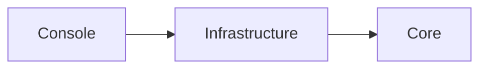

# DEVELOPER.NetConsole.md

Stand: 2026-05-01

## Zweck

Diese Datei definiert die .NET-spezifischen Entwicklungsregeln fuer Konsolenanwendungen dieses Repositories. Allgemeine Regeln stehen in `DEVELOPER.md`. Sie ist fuer fachlich relevante Konsolenanwendungen gedacht: Eingaben entgegennehmen, Konfiguration laden, externe Datenquellen ansprechen, Daten parsen, fachliche Workflows ausfuehren, Ergebnisse berechnen und strukturierte Exporte erzeugen.

## Versionsbasis

.NET-Konsolenanwendungen zielen auf `net10.0`.

Verbindlich sind die Versionen in:

- `global.json`
- `.csproj`
- `Directory.Build.props`
- CI-Konfiguration

`Nullable` und `ImplicitUsings` sind aktiviert. File-scoped namespaces sind Standard. Projektweite Namespaces werden pro Projekt ueber `GlobalUsings.cs` verwaltet.

## Zielbild

.NET-Konsolenanwendungen bestehen aus genau drei produktiven Projekten innerhalb einer Solution:

- `<Name>.Console`
- `<Name>.Infrastructure`
- `<Name>.Core`

Die Referenzrichtung ist verbindlich:

```text
<Name>.Console --> <Name>.Infrastructure --> <Name>.Core
```

`Core` ist die fachliche Mitte der Anwendung. Dort liegen Domain, Use Cases, Ports, fachliche Services, Ergebnisobjekte und fachliche Fehler. `Infrastructure` implementiert technische Details und Ports aus `Core`. `Console` ist der Composition Root und enthaelt Host, Konfiguration, DI-Bootstrap sowie Konsoleneingabe und Konsolenausgabe.



## Standardstruktur

Die Projektstruktur richtet sich nach Domain-Driven Design auf Solution-Ebene. Die drei Hauptprojekte liegen direkt auf oberster Ebene der Solution, nicht unterhalb eines `src/`-Ordners.

```text
<Name>.sln
<Name>.Console/
  Program.cs
  GlobalUsings.cs
  Module.cs
  appsettings.json
  Services/
<Name>.Infrastructure/
  GlobalUsings.cs
  Module.cs
  Common/
  Configuration/
  <Provider1>/
  <Provider2>/
  <Provider3>/
<Name>.Core/
  GlobalUsings.cs
  Module.cs
  Enums/
  Interfaces/
  Models/
  Services/
  Exceptions/
  Utilities/
tests/
  <Name>.Core.Tests/
  <Name>.Infrastructure.Tests/
  <Name>.Console.Tests/
```

| Pfad | Bereich | Zweck |
|---|---|---|
| `<Name>.sln` | Solution | Enthaelt genau die produktiven Projekte `Console`, `Infrastructure`, `Core` sowie passende Testprojekte. |
| `<Name>.Console/` | Console | Startbares Projekt. Referenziert `Infrastructure`. |
| `<Name>.Console/Program.cs` | Console | Composition Root. Baut Generic Host, Konfiguration, Logging und DI auf. Enthaelt keine Fachlogik. |
| `<Name>.Console/GlobalUsings.cs` | Console | Enthaelt alle globalen `using`-Direktiven des Console-Projekts. |
| `<Name>.Console/Module.cs` | Console | Enthaelt statische Extension-Methode `AddConsole(...)` fuer konsolenspezifische DI-Registrierung. |
| `<Name>.Console/appsettings.json` | Console | Runtime-Konfiguration fuer Provider, Timeouts, Retry, Export und fachliche Settings. Keine vertraulichen Werte. |
| `<Name>.Console/Services/` | Console | Enthält Konsolen-nahe Services fuer Ein- und Ausgabe sowie Startlogik. |
| `<Name>.Infrastructure/` | Infrastructure | Technische Implementierungen. Referenziert `Core`. Wird von `Console` referenziert. |
| `<Name>.Infrastructure/GlobalUsings.cs` | Infrastructure | Enthaelt alle globalen `using`-Direktiven des Infrastructure-Projekts. |
| `<Name>.Infrastructure/Module.cs` | Infrastructure | Enthaelt statische Extension-Methode `AddInfrastructure(...)` fuer technische DI-Registrierung. Ruft bei Bedarf `AddCore(...)` auf. |
| `<Name>.Infrastructure/Common/` | Infrastructure | Enthaelt provideruebergreifende technische Hilfen und gemeinsame Adapterbausteine. |
| `<Name>.Infrastructure/Configuration/` | Infrastructure | Typisierte Konfiguration und Validierung technischer Settings. |
| `<Name>.Infrastructure/<Provider1>/` | Infrastructure | Enthaelt die technische Implementierung eines konkreten Providers oder Fremdsystems. |
| `<Name>.Infrastructure/<Provider2>/` | Infrastructure | Enthaelt die technische Implementierung eines weiteren Providers oder Fremdsystems. |
| `<Name>.Infrastructure/<Provider3>/` | Infrastructure | Enthaelt die technische Implementierung eines weiteren Providers oder Fremdsystems. |
| `<Name>.Core/` | Core | Fachliche Mitte. Keine Referenz auf `Console` oder `Infrastructure`. |
| `<Name>.Core/GlobalUsings.cs` | Core | Enthaelt alle globalen `using`-Direktiven des Core-Projekts. |
| `<Name>.Core/Module.cs` | Core | Enthaelt statische Extension-Methode `AddCore(...)` fuer fachliche DI-Registrierung. |
| `<Name>.Core/Enums/` | Core | Enthaelt zentrale fachliche Enums. |
| `<Name>.Core/Interfaces/` | Core | Enthaelt Ports, Vertraege und fachliche Schnittstellen. |
| `<Name>.Core/Models/` | Core | Enthaelt fachliche Modelle, DTOs, Value Objects und Ergebnisobjekte. |
| `<Name>.Core/Services/` | Core | Enthaelt fachliche Services, Use Cases und Workflows. |
| `<Name>.Core/Exceptions/` | Core | Enthaelt fachlich erwartbare Fehler. |
| `<Name>.Core/Utilities/` | Core | Enthaelt fachlich neutrale Hilfen mit Bezug zum Core-Projekt. |
| `tests/<Name>.Core.Tests/` | Tests | Tests fuer Domain, Use Cases, Workflows, Ports und fachliche Regeln. |
| `tests/<Name>.Infrastructure.Tests/` | Tests | Tests fuer Adapter, Provider, Parser, Retry, Serialisierung, Export und Konfigurationsbindung. |
| `tests/<Name>.Console.Tests/` | Tests | Tests fuer Konsoleneingabe, Ausgabeformatierung, Host-Start und DI-Verkabelung. |

## Module.cs und DI

Jedes der drei Hauptprojekte enthaelt eine `Module.cs`. Diese Datei ist der zentrale Einstiegspunkt fuer DI-Registrierung des jeweiligen Projekts.

```csharp
public static class Module
{
    public static IServiceCollection AddCore(this IServiceCollection services)
    {
        return services;
    }
}
```

Die Methodennamen sind verbindlich:

- `<Name>.Console/Module.cs`: `AddConsole(...)`
- `<Name>.Infrastructure/Module.cs`: `AddInfrastructure(...)`
- `<Name>.Core/Module.cs`: `AddCore(...)`

`Program.cs` registriert die Anwendung ueber diese Module, statt einzelne Services direkt zusammenzusuchen.

## Projekt- und Referenzregeln

- `Console` referenziert `Infrastructure`; `Infrastructure` referenziert `Core`; `Core` referenziert kein produktives Projekt.
- `Console` kennt technische Implementierungen nur ueber DI; Ports liegen in `Core`, Adapter in `Infrastructure`.
- `Core` kennt keine Konsole, keinen Host, keinen `HttpClient`, keine Options-Bindings und keinen DI-Container als Laufzeitdetail.

## Domain-Driven-Design-Regeln

- Fachliche Begriffe, Value Objects, Domain Services, Regeln und fachliche Fehler liegen in `Core`.
- Application Workflows in `Core` orchestrieren Use Cases ueber Ports, verstecken aber keine fachlichen Regeln in langen Ablaufbloecken.
- Exportmodelle sind Austauschformate und nicht automatisch Domainmodelle.

## Console und Bootstrap

- `Program.cs` baut Generic Host, Konfiguration, Logging und DI auf und startet genau eine Console Application oder einen Use Case Runner.
- Konsoleneingabe und Konsolenausgabe liegen in `Services/` und sind deterministisch testbar.
- Konsolentexte sind knapp, fachlich und frei von technischen Interna.

## Core-Regeln

- Use Cases und Workflows haben klare fachliche Namen und liefern explizite Ergebnis- und Statusobjekte.
- Lang laufende Operationen akzeptieren `CancellationToken`.
- Application DTOs enthalten keine rohen Transportobjekte externer APIs.

## Infrastructure, Provider und externe Dienste

- Externe Dienste werden ueber Ports aus `Core` angesprochen und in `Infrastructure` implementiert.
- Retry, Timeout, Backoff, Fallback und Konfigurationsbindung liegen in `Infrastructure`.
- Parser wandeln Rohdaten an der Grenze in interne Modelle und erhalten relevante Quelleninformationen.

## Geometrie, Berechnung und fachliche Ableitungen

- Fachliche Berechnungen liegen in `Core`, nicht in `Console` oder technischen Clients.
- Etablierte Geometrie- oder Berechnungsbibliotheken werden genutzt, wenn sie robuste fachliche Logik verbessern.
- Abgeleitete Werte tragen Herkunftsinformationen, wenn dies fachlich relevant ist.

## Export, Schema und Serialisierung

- Fachliche Exportvertraege und Export-DTOs liegen in `Core`, wenn sie Bestandteil des Austauschformats sind.
- Konkrete Serialisierung, Dateinamen, Exportpfade, Schema-Kopie und Dateisystemzugriffe liegen in `Infrastructure`.
- Export-DTOs, Serialisierung und Schema werden synchron gehalten.

## Konfiguration

- Konfiguration wird in `Console` geladen und in `Infrastructure` typisiert gebunden und validiert.
- Pflichtkonfiguration scheitert frueh mit klarer Fehlermeldung.
- `Core` liest keine Konfiguration direkt; fachlich relevante Parameter werden explizit uebergeben.

## Fehler, Logging und Status

- Fachliche Fehler und Statusmodelle liegen in `Core`.
- Technische Fehler entstehen in `Infrastructure` und werden dort mit Kontext angereichert.
- Logs erklaeren technische Ursachen, ersetzen aber keine fachlichen Statusobjekte.

## Code-Regeln

- File-scoped namespaces, `Nullable`, `ImplicitUsings` und projektweite `GlobalUsings.cs` sind Standard.
- Jeder oeffentliche Typ liegt in einer eigenen Datei; Records sind fuer immutable DTOs, Value Objects und Ergebnisobjekte bevorzugt.
- Keine rohen API-DTOs in `Core` oder `Console`.

## Dokumentation und Strukturpflege

- Repositories mit AI-/Agent-Nutzung fuehren eine `AGENTS.md` oder gleichwertige Arbeitsregeldatei.
- Groessere Projekte fuehren eine `STRUCTURE.md` als lebenden Index wichtiger Dateien, Typen, Tests und Verantwortlichkeiten.
- Struktur-Dokumentation wird aktualisiert, wenn Typen, Projekte, Verantwortlichkeiten oder relevante Ordner geaendert werden.

## Unit Tests, Workflow-Tests und Infrastrukturtests

- Fachliche Regeln und Workflows werden in `Core.Tests` mit Fake-Ports und kontrollierten Testdaten abgesichert.
- Infrastrukturtests pruefen Adapter, Provider, Parser, Retry, Serialisierung, Export und Konfigurationsbindung ohne instabile Live-Dienste.
- Konsolentests pruefen Eingabe, Ausgabe, Host-Start und DI-Verkabelung deterministisch.

## Definition of Done fuer .NET-Console-Aenderungen

- Solution enthaelt die produktiven Projekte `Console`, `Infrastructure` und `Core` auf oberster Ebene mit korrekter Referenzrichtung.
- Build und relevante Core-, Infrastructure- und Console-Tests sind erfolgreich.
- `Module.cs`, Export/Schema und Struktur-Dokumentation sind aktualisiert, wenn die Aenderung sie betrifft.
