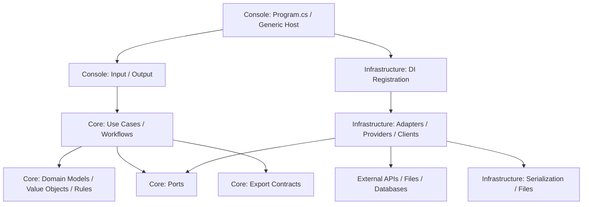

# DEVELOPER.NetConsole.md

Stand: 2026-05-01

## Zweck

Diese Datei definiert die .NET-spezifischen Entwicklungsregeln fuer Konsolenanwendungen dieses Repositories. Allgemeine Regeln stehen in `DEVELOPER.md`.

Sie ist fuer fachlich relevante Konsolenanwendungen gedacht: Eingaben entgegennehmen, Konfiguration laden, externe Datenquellen ansprechen, Daten parsen, fachliche Workflows ausfuehren, Ergebnisse berechnen und strukturierte Exporte erzeugen.

## Versionsbasis

.NET-Konsolenanwendungen zielen auf `net10.0`.

Verbindlich sind die Versionen in:

- `global.json`
- `.csproj`
- `Directory.Build.props`
- CI-Konfiguration

`Nullable` und `ImplicitUsings` sind aktiviert. File-scoped namespaces sind Standard. Projektweite Namespaces werden pro Projekt ueber `GlobalUsings.cs` verwaltet.

## Zielbild

.NET-Konsolenanwendungen bestehen aus genau drei produktiven Projekten innerhalb einer Solution:

- `<Name>.Console`
- `<Name>.Infrastructure`
- `<Name>.Core`

Die Referenzrichtung ist verbindlich:

```text
<Name>.Console --> <Name>.Infrastructure --> <Name>.Core
```

`Core` ist die fachliche Mitte der Anwendung. Dort liegen Domain, Use Cases, Ports, fachliche Services, Ergebnisobjekte und fachliche Fehler. `Infrastructure` implementiert technische Details und Ports aus `Core`. `Console` ist der Composition Root und enthaelt nur Host, Konfiguration, DI-Bootstrap sowie Konsoleneingabe und Konsolenausgabe.



## Standardstruktur

Die Projektstruktur richtet sich nach Domain-Driven Design auf Solution-Ebene. DDD wird nicht als Ordnergruppe innerhalb eines einzigen Konsolenprojekts umgesetzt, sondern durch die drei Projekte `Console`, `Infrastructure` und `Core`.

```text
<Name>.sln
src/
  <Name>.Console/
    Program.cs
    GlobalUsings.cs
    appsettings.json
    Presentation/
      Console/
    DependencyInjection/
  <Name>.Infrastructure/
    GlobalUsings.cs
    DependencyInjection/
    Configuration/
    ExternalServices/
    Persistence/
    Serialization/
    Providers/
  <Name>.Core/
    GlobalUsings.cs
    Application/
      Abstractions/
      Workflows/
      UseCases/
      Dtos/
    Domain/
      Models/
      ValueObjects/
      Services/
      Rules/
      Exceptions/
    Export/
      Contracts/
      Schemas/
tests/
  <Name>.Core.Tests/
  <Name>.Infrastructure.Tests/
  <Name>.Console.Tests/
```

| Pfad | Bereich | Zweck |
|---|---|---|
| `<Name>.sln` | Solution | Enthaelt genau die produktiven Projekte `Console`, `Infrastructure`, `Core` sowie passende Testprojekte. |
| `src/<Name>.Console/` | Console | Startbares Projekt. Referenziert `Infrastructure`; keine direkte Referenz auf `Core`, ausser wenn bestehende Tooling-Gruende das zwingend erfordern. |
| `src/<Name>.Console/Program.cs` | Console | Composition Root. Baut Generic Host, Konfiguration, Logging und DI auf. Enthaelt keine Fachlogik. |
| `src/<Name>.Console/appsettings.json` | Console | Runtime-Konfiguration fuer Provider, Timeouts, Retry, Export und fachliche Settings. Keine vertraulichen Werte. |
| `src/<Name>.Console/Presentation/Console/` | Console | Konsoleneingabe, Ausgabeformatierung, Statusmeldungen, Prompting und Exit-Kommandos. |
| `src/<Name>.Console/DependencyInjection/` | Console | Host-nahe Registrierung und Aufruf der Infrastructure-Registrierung. Keine Adapterimplementierungen. |
| `src/<Name>.Infrastructure/` | Infrastructure | Technische Implementierungen. Referenziert `Core`. Wird von `Console` referenziert. |
| `src/<Name>.Infrastructure/DependencyInjection/` | Infrastructure | Registriert technische Services, Options, HttpClients, Provider, Parser, Serializer und Exporter. |
| `src/<Name>.Infrastructure/Configuration/` | Infrastructure | Typisierte Konfiguration und Validierung technischer Settings. |
| `src/<Name>.Infrastructure/ExternalServices/` | Infrastructure | Clients fuer externe APIs, Geocoder, WFS/OGC, Dateisysteme oder andere Fremdsysteme. |
| `src/<Name>.Infrastructure/Persistence/` | Infrastructure | Lokale Persistenz, Caches, temporaere Dateien und Dateisystemzugriffe. |
| `src/<Name>.Infrastructure/Serialization/` | Infrastructure | JSON/XML/CSV-Serialisierung, Parser und Schema-nahe Logik. |
| `src/<Name>.Infrastructure/Providers/` | Infrastructure | Regionale oder austauschbare technische Provider. |
| `src/<Name>.Core/` | Core | Fachliche Mitte. Keine Referenz auf `Console` oder `Infrastructure`. |
| `src/<Name>.Core/Application/` | Core | Orchestriert Use Cases, Workflows, Ports und Transaktionen zwischen Domain und technischer Aussenwelt. |
| `src/<Name>.Core/Application/Abstractions/` | Core | Ports fuer externe Datenquellen, Export, Zeit, Dateisystem, HTTP-nahe Adapter und weitere Infrastruktur. |
| `src/<Name>.Core/Application/Workflows/` | Core | Ablaufsteuerung komplexer Use Cases, z. B. Daten laden, parsen, matchen, berechnen und exportieren. |
| `src/<Name>.Core/Application/UseCases/` | Core | Einzelne fachliche Anwendungsfaelle mit klaren Eingaben und Ergebnissen. |
| `src/<Name>.Core/Application/Dtos/` | Core | Anwendungsnahe DTOs fuer Use-Case-Ergebnisse und interne Prozessgrenzen. Keine rohen API-DTOs. |
| `src/<Name>.Core/Domain/` | Core | Fachliche Modelle, Value Objects, Regeln, Services, Fehler und Invarianten. |
| `src/<Name>.Core/Domain/Models/` | Core | Aggregates, Entities und fachliche Datenmodelle. |
| `src/<Name>.Core/Domain/ValueObjects/` | Core | Fachliche Primitive wie Adresse, Koordinate, Flaeche, Hoehe, Metrik oder Identifier. |
| `src/<Name>.Core/Domain/Services/` | Core | Reine fachliche Berechnungen, Matching, Auswahl-, Bewertungs- und Ableitungslogik. |
| `src/<Name>.Core/Domain/Rules/` | Core | Wiederverwendbare fachliche Regeln, Spezifikationen und Entscheidungslogik. |
| `src/<Name>.Core/Domain/Exceptions/` | Core | Fachlich erwartbare Fehler, keine technischen Transportfehler. |
| `src/<Name>.Core/Export/` | Core | Fachliche Exportvertraege, Export-DTOs und Schema-Definitionen, soweit sie das Austauschformat beschreiben. |
| `tests/<Name>.Core.Tests/` | Tests | Tests fuer Domain, Use Cases, Workflows, Ports und fachliche Regeln. |
| `tests/<Name>.Infrastructure.Tests/` | Tests | Tests fuer Adapter, Provider, Parser, Retry, Serialisierung, Export und Konfigurationsbindung. |
| `tests/<Name>.Console.Tests/` | Tests | Tests fuer Konsoleneingabe, Ausgabeformatierung, Host-Start und DI-Verkabelung. |

## Projekt- und Referenzregeln

- `Console` referenziert `Infrastructure`.
- `Infrastructure` referenziert `Core`.
- `Core` referenziert kein produktives Projekt der Solution.
- `Infrastructure` referenziert `Console` nie.
- `Core` kennt keine Konsole, keinen Host, keine Options-Bindings, keinen `HttpClient`, keine Datei-Implementierung und keinen DI-Container.
- Wenn `Console` Use Cases ausfuehrt, erhaelt es diese ueber DI. Die konkrete Registrierung kommt aus `Infrastructure`.
- Ports liegen in `Core`; Adapter liegen in `Infrastructure`.
- Exportvertraege, fachliche Ergebnisobjekte und Statusmodelle liegen in `Core`; konkrete Serialisierung und Dateiausgabe liegen in `Infrastructure`.

## Domain-Driven-Design-Regeln

- Fachliche Begriffe werden in `Core` explizit modelliert. Primitive Obsession wird vermieden, wenn Identifier, Adressen, Koordinaten, Flaechen, Hoehen, Status oder Quellen fachliche Bedeutung haben.
- Value Objects validieren sich selbst oder werden ueber klare Factory-Methoden erzeugt.
- Domain Services enthalten reine fachliche Logik: Matching, Auswahl, Klassifikation, Berechnung, Aggregation und Plausibilisierung.
- Application Workflows in `Core` orchestrieren, aber sie verstecken keine fachlichen Regeln in langen Ablaufbloecken.
- Infrastructure implementiert Ports aus `Core/Application/Abstractions/`. Die Richtung der Abhaengigkeiten zeigt nach innen.
- Fachliche Fehler werden in `Core` modelliert und getestet. Technische Fehler werden in `Infrastructure` uebersetzt oder mit Kontext angereichert.
- Exportmodelle sind nicht automatisch Domainmodelle. Sie sind ein Austauschformat und duerfen eigene DTOs besitzen.

## Console und Bootstrap

- Anwendungen verwenden den Generic Host.
- `Program.cs` laedt Konfiguration, baut den Host und startet genau eine Console Application oder einen Use Case Runner.
- `Program.cs` enthaelt keine fachliche Entscheidung, keine HTTP-Aufrufe, keine Parserlogik und keine Exportlogik.
- Constructor Injection ist Standard.
- Service-Registrierung in `Console` bleibt hostnah und delegiert technische Registrierung an `Infrastructure`.
- Typische Registrierung: `services.AddInfrastructure(configuration)` und optional `services.AddConsolePresentation()`.
- Konsoleneingabe und Konsolenausgabe sind so gekapselt, dass sie deterministisch getestet werden koennen.
- Exit-Kommandos, leere Eingaben und Validierungsfehler werden konsistent behandelt.
- Konsolentexte sind fachlich knapp und duerfen keine technischen Interna voraussetzen.

## Core-Regeln

- Use Cases und Workflows haben klare fachliche Namen, z. B. `ExtractBuildingDataWorkflow`, `GenerateExportUseCase` oder `ResolveCadastralContextUseCase`.
- Workflows koordinieren Schritte wie Eingabevalidierung, Geocoding, Provider-Auswahl, Datenabruf, Parsing, Matching, Berechnung und Export ueber Ports.
- Jeder groessere Workflow nutzt private Methoden oder kleinere Services fuer klar benannte Zwischenschritte.
- Lang laufende Operationen akzeptieren `CancellationToken`.
- Ergebnisse enthalten fachlich relevante Statusinformationen: erfolgreich, partiell, keine Daten, externer Fehler, ungueltige Eingabe.
- Wiederholbare Schritte sind idempotent, wenn sie durch Retry oder erneuten Start mehrfach ausgefuehrt werden koennen.
- Application DTOs sind bewusst geschnitten und enthalten keine rohen Transportobjekte externer APIs.
- Core darf auf fachlich neutrale Bibliotheken zugreifen, wenn sie Domainlogik stabil und ohne Infrastrukturkopplung verbessern. Technische Integration bleibt trotzdem ausserhalb von Core.

## Infrastructure, Provider und externe Dienste

- Externe Dienste werden ueber Ports aus `Core` angesprochen und in `Infrastructure` implementiert.
- HTTP-Clients liegen hinter klaren Clients oder Providern. Keine HTTP-Aufrufe aus `Core`, `Console` oder Tests ohne Fake.
- Provider kapseln regionale, technische oder produktbezogene Unterschiede.
- Direkte Identifier-basierte Abfragen sind bevorzugt, wenn die Datenquelle sie stabil unterstuetzt. Geometrie-, Such- oder Fallback-Strategien bleiben explizit modelliert.
- Retry, Timeout, Backoff und Fallback werden konfigurierbar umgesetzt.
- Externe Dienste koennen `502`, Timeouts, leere Antworten oder unvollstaendige Daten liefern. Diese Faelle werden fachlich und testbar behandelt.
- Parser wandeln Rohdaten in interne Modelle und verlieren relevante Quelleninformationen nicht unbemerkt.
- Technische Rohdaten werden nicht durch die Anwendung gereicht, wenn sie an der Grenze bereits in fachliche Modelle gemappt werden koennen.
- Infrastruktur darf Core-Typen erzeugen, aber Core-Typen duerfen keine Infrastrukturtypen enthalten.

## Geometrie, Berechnung und fachliche Ableitungen

- Fachliche Berechnungen liegen in `Core`, nicht in `Console` oder Infrastructure Clients.
- Bei geometrischen Berechnungen werden etablierte Bibliotheken verwendet, wenn sie im Projekt vorhanden sind. Keine ad-hoc Polygonlogik, wenn eine robuste Bibliothek passt.
- Abgeleitete Werte tragen Herkunftsinformationen, wenn fachlich relevant: berechnet, geschaetzt, aus Quelle uebernommen oder aus Kontext abgeleitet.
- Rundung, Einheiten und Koordinatenreferenzsysteme werden zentral und konsistent behandelt.
- Matching-Entscheidungen speichern ihre Begruendung, z. B. Match-Quelle, Confidence, Overlap, Distanz oder Fallback-Pfad.
- Kontextobjekte duerfen intern fuer Berechnungen genutzt werden, ohne automatisch Bestandteil eines Exports zu werden.

## Export, Schema und Serialisierung

- Fachliche Exportvertraege und Export-DTOs liegen in `Core`, wenn sie Bestandteil des Austauschformats sind.
- Konkrete Serialisierung, Dateinamen, Exportpfade, Schema-Kopie und Dateisystemzugriffe liegen in `Infrastructure`.
- Exportlogik liegt nicht in `Console` und nicht als langer Block im Workflow, sondern in einer Factory, einem Mapper oder einem Export Service.
- Export-DTOs sind eigene Typen und beschreiben das Austauschformat, nicht automatisch die interne Domainstruktur.
- JSON-Exporte schreiben Nullable Properties explizit als `null`, wenn das Schema dies vorsieht.
- Export-Schema und Export-DTOs werden synchron gehalten.
- Aenderungen an Exportfeldern, Metriken, Summaries, Statuswerten oder Source-Metadata werden im Schema gespiegelt.
- Interne Diagnosewerte werden nicht automatisch exportiert. Exportfelder muessen fachlich begruendet sein.

## Konfiguration

- Konfiguration wird in `Console` geladen und in `Infrastructure` typisiert gebunden und validiert.
- Pflichtkonfiguration scheitert frueh mit klarer Fehlermeldung.
- Sensitive Werte werden nicht versioniert und nicht geloggt.
- Timeouts, Retry-Anzahl, Backoff, Provider-URLs, Exportpfade und Feature-Flags sind konfigurierbar.
- Effektive abgeleitete Werte duerfen in Settings-Typen gekapselt werden, sofern Kompatibilitaet und Validierung klar bleiben.
- `Core` liest keine Konfiguration direkt. Fachlich relevante Parameter werden ueber Use-Case-Eingaben, Options-nahe Werte oder explizite Services uebergeben.

## Fehler, Logging und Status

- Fachliche Fehler und Statusmodelle liegen in `Core`.
- Technische Fehler entstehen in `Infrastructure` und werden dort mit Datenquelle, Operation und Status angereichert.
- Logs erklaeren technische Ursachen und Ablaufpunkte, ersetzen aber keine fachlichen Statusobjekte.
- Nutzernahe Konsolenausgaben sind knapp, fachlich und handlungsorientiert.
- Exceptions werden nicht fuer normale Entscheidungslogik genutzt.
- Fehlerpfade werden getestet, insbesondere leere externe Antworten, Timeouts, ungueltige Eingaben und nicht unterstuetzte Regionen oder Provider.

## Code-Regeln

- File-scoped namespaces sind Pflicht.
- Projektweite `global using`-Direktiven werden pro Projekt in `GlobalUsings.cs` gepflegt.
- Lokale `using`-Direktiven in einzelnen Dateien sind Ausnahme und muessen dateispezifisch sinnvoll sein.
- Jeder oeffentliche Typ liegt in einer eigenen Datei.
- Records sind fuer immutable DTOs, Value Objects und Ergebnisobjekte bevorzugt.
- Klassen sind fuer Services, Clients, Provider und zustandsbehaftete Komponenten bevorzugt.
- Interfaces werden fuer Ports und austauschbare technische Adapter genutzt, nicht fuer jeden Service reflexartig.
- Methoden bleiben klein genug, dass ihr fachlicher Zweck direkt erkennbar ist.
- Lange Inline-Bloecke werden in klar benannte private Methoden oder eigene Services extrahiert.
- Keine zirkulaeren Abhaengigkeiten zwischen `Console`, `Infrastructure` und `Core`.
- Keine rohen API-DTOs in `Core` oder `Console`.

## Dokumentation und Strukturpflege

- Repositories mit AI-/Agent-Nutzung fuehren eine `AGENTS.md` oder gleichwertige Arbeitsregeldatei.
- Groessere Projekte fuehren eine `STRUCTURE.md` als lebenden Index wichtiger Dateien, Typen, Tests und Verantwortlichkeiten.
- Bei neuen, entfernten, verschobenen oder umbenannten Klassen, Records, Interfaces, Services, Providern, DTOs oder Tests wird die Struktur-Dokumentation aktualisiert.
- Beschreibungen bleiben kurz, deutsch und zweckorientiert: Was ist der Typ, wofuer existiert er, welche Rolle hat er im System?
- Generierte lokale Ausgaben, Debug-Exporte und Build-Artefakte werden nicht als Implementierungsquelle verwendet.

## Unit Tests, Workflow-Tests und Infrastrukturtests

- Fachliche Regeln werden in `Core.Tests` abgesichert.
- Workflows werden in `Core.Tests` mit Fake-Ports und kontrollierten Testdaten getestet.
- Infrastrukturtests pruefen URL-Building, Parser, Retry, Serialisierung, Export und Konfigurationsbindung, ohne von instabilen Live-Diensten abzuhaengen.
- Konsolentests kapseln `Console.In` und `Console.Out` deterministisch.
- Exportaenderungen werden in Core- und Infrastructure-Tests abgesichert: Vertrag in Core, konkrete Serialisierung in Infrastructure.
- Geometrie- und Matching-Faelle werden mit kleinen, expliziten Testdaten modelliert.
- Tests pruefen sichtbares Verhalten und fachliche Zustandsaenderungen, nicht private Implementierungsdetails.
- Der Volltest laeuft ueber die Solution, z. B. `dotnet test <Solution>.sln`.

## Definition of Done fuer .NET-Console-Aenderungen

- Solution enthaelt die produktiven Projekte `Console`, `Infrastructure` und `Core` mit korrekter Referenzrichtung.
- Build erfolgreich.
- Relevante Core-, Infrastructure- und Console-Tests erfolgreich.
- Neue fachliche Regeln sind in `Core.Tests` getestet.
- Konfiguration ist typisiert und validiert.
- Export-DTOs, Serialisierung und Schema sind synchron.
- `AGENTS.md` bzw. `STRUCTURE.md` ist aktualisiert, wenn Struktur oder Verantwortlichkeiten geaendert wurden.
- Keine vertraulichen Werte oder instabilen Live-Exportdateien im Commit.
