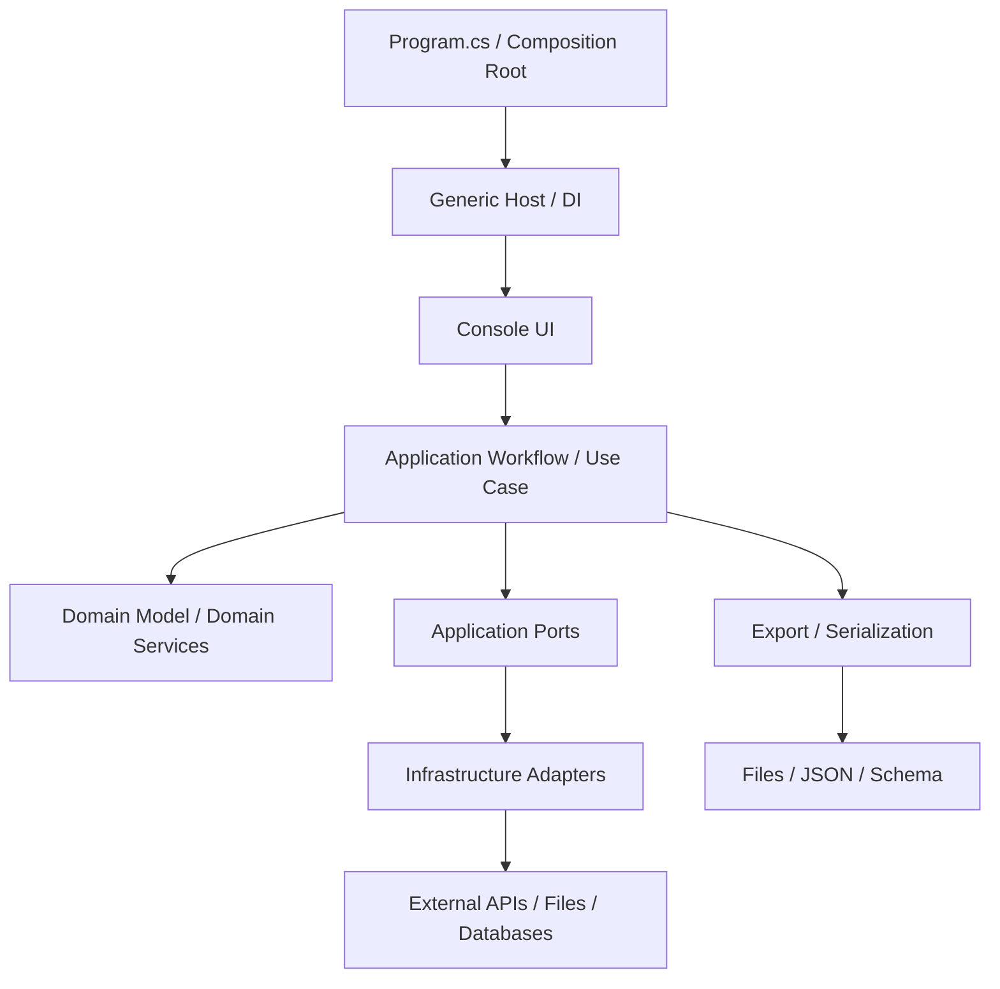

# DEVELOPER.NetConsole.md

Stand: 2026-05-01

## Zweck

Diese Datei definiert die .NET-spezifischen Entwicklungsregeln fuer Konsolenanwendungen dieses Repositories. Allgemeine Regeln stehen in `DEVELOPER.md`.

Sie ist fuer fachlich relevante Konsolenanwendungen gedacht: Eingaben entgegennehmen, Konfiguration laden, externe Datenquellen ansprechen, Daten parsen, fachliche Workflows ausfuehren, Ergebnisse berechnen und strukturierte Exporte erzeugen.

## Versionsbasis

.NET-Konsolenanwendungen zielen auf `net10.0`.

Verbindlich sind die Versionen in:

- `global.json`
- `.csproj`
- `Directory.Build.props`
- CI-Konfiguration

`Nullable` und `ImplicitUsings` sind aktiviert. File-scoped namespaces sind Standard. Projektweite Namespaces werden ueber `GlobalUsings.cs` verwaltet.

## Zielbild

.NET-Konsolenanwendungen werden als kleine, klar geschnittene fachliche Systeme gebaut. Die Konsole ist nur Ein- und Ausgabeschicht. Fachliche Entscheidungen liegen in Domain und Application. Technische Integrationen liegen in Infrastructure.



## Standardstruktur

Die Projektstruktur richtet sich nach Domain-Driven Design. Technische Ordner wie `Services/` oder `DataProviders/` duerfen in bestehenden Projekten vorkommen, sind aber nicht das Zielbild fuer neue oder groesser umgebaute Anwendungen.

```text
<Project>/
  Program.cs
  GlobalUsings.cs
  appsettings.json
  schema.json
  Application/
    Abstractions/
    Workflows/
    UseCases/
    Dtos/
  Domain/
    Models/
    ValueObjects/
    Services/
    Rules/
    Exceptions/
  Infrastructure/
    DependencyInjection/
    Configuration/
    ExternalServices/
    Persistence/
    Serialization/
    Providers/
  Presentation/
    Console/
<Project>.Tests/
  Application/
  Domain/
  Infrastructure/
  Presentation/
  TestSupport/
```

| Pfad | Bereich | Zweck |
|---|---|---|
| `Program.cs` | Bootstrap | Composition Root. Baut Host, Konfiguration, Logging und DI auf. Enthaelt keine Fachlogik. |
| `GlobalUsings.cs` | Bootstrap | Zentrale `global using`-Direktiven und Aliase. |
| `appsettings.json` | Konfiguration | Runtime-Konfiguration fuer Provider, Timeouts, Retry, Export und fachliche Settings. |
| `schema.json` | Export | Verbindliches Export- oder Austauschschema, falls JSON-Exporte Teil der Anwendung sind. |
| `Application/` | Application | Orchestriert Use Cases, Workflows, Ports und Transaktionen zwischen Domain und Infrastruktur. |
| `Application/Abstractions/` | Application | Ports fuer externe Datenquellen, Export, Zeit, Dateisystem, HTTP-nahe Adapter und weitere Infrastruktur. |
| `Application/Workflows/` | Application | Ablaufsteuerung komplexer Use Cases, z. B. Daten laden, parsen, matchen, berechnen und exportieren. |
| `Application/UseCases/` | Application | Einzelne fachliche Anwendungsfaelle mit klaren Eingaben und Ergebnissen. |
| `Application/Dtos/` | Application | Anwendungsnahe DTOs fuer Use-Case-Ergebnisse und interne Prozessgrenzen. Keine rohen API-DTOs. |
| `Domain/` | Domain | Fachliche Modelle, Value Objects, Regeln, Services, Fehler und Invarianten. Keine Infrastrukturabhaengigkeiten. |
| `Domain/Models/` | Domain | Aggregates, Entities und fachliche Datenmodelle. |
| `Domain/ValueObjects/` | Domain | Fachliche Primitive wie Adresse, Koordinate, Flaeche, Hoehe, Metrik oder Identifier. |
| `Domain/Services/` | Domain | Reine fachliche Berechnungen, Matching, Auswahl-, Bewertungs- und Ableitungslogik. |
| `Domain/Rules/` | Domain | Wiederverwendbare fachliche Regeln, Spezifikationen und Entscheidungslogik. |
| `Domain/Exceptions/` | Domain | Fachlich erwartbare Fehler, keine technischen Transportfehler. |
| `Infrastructure/` | Infrastructure | Implementiert technische Details: HTTP, Dateien, Provider, Parser, Serializer, technische Adapter. |
| `Infrastructure/DependencyInjection/` | Infrastructure | Registriert Services, Options, HttpClients, Provider, Parser und Exporter. |
| `Infrastructure/Configuration/` | Infrastructure | Typisierte Konfiguration und Validierung. |
| `Infrastructure/ExternalServices/` | Infrastructure | Clients fuer externe APIs, Geocoder, WFS/OGC, Dateisysteme oder andere Fremdsysteme. |
| `Infrastructure/Persistence/` | Infrastructure | Lokale Persistenz, Caches, temp-Dateien und Dateisystemzugriffe. |
| `Infrastructure/Serialization/` | Infrastructure | JSON/XML/CSV-Serialisierung, Parser und Schema-nahe Logik. |
| `Infrastructure/Providers/` | Infrastructure | Regionale oder austauschbare technische Provider. |
| `Presentation/Console/` | Presentation | Konsoleneingabe, Ausgabeformatierung, Statusmeldungen, Prompting und Exit-Kommandos. |
| `<Project>.Tests/` | Tests | Unit-, Workflow-, Infrastruktur- und Konsolentests. Tests spiegeln die Hauptordner. |
| `<Project>.Tests/TestSupport/` | Tests | Testdaten, Fake-Provider, Fake-HTTP-Handler, Builder und Konsolenhilfen. |

## Domain-Driven-Design-Regeln

- `Domain/` kennt keine `HttpClient`, Konfiguration, Logger, Dateipfade, JSON/XML-Serializer oder DI-Container.
- Fachliche Begriffe werden explizit modelliert. Primitive Obsession wird vermieden, wenn Identifier, Adressen, Koordinaten, Flaechen, Hoehen, Status oder Quellen fachliche Bedeutung haben.
- Value Objects validieren sich selbst oder werden ueber klare Factory-Methoden erzeugt.
- Domain Services enthalten reine fachliche Logik: Matching, Auswahl, Klassifikation, Berechnung, Aggregation und Plausibilisierung.
- Application Workflows orchestrieren, aber sie verstecken keine fachlichen Regeln in langen Ablaufbloecken.
- Infrastructure implementiert Ports aus `Application/Abstractions/`. Die Richtung der Abhaengigkeiten zeigt nach innen.
- Fachliche Fehler werden modelliert und getestet. Technische Fehler werden an Infrastrukturgrenzen uebersetzt oder mit Kontext angereichert.
- Exportmodelle sind nicht automatisch Domainmodelle. Sie sind ein Austauschformat und duerfen eigene DTOs besitzen.

## Konsolenanwendung und Bootstrap

- Anwendungen verwenden den Generic Host.
- `Program.cs` laedt Konfiguration, baut den Host und startet genau eine Console Application oder einen Use Case Runner.
- `Program.cs` enthaelt keine fachliche Entscheidung, keine HTTP-Aufrufe, keine Parserlogik und keine Exportlogik.
- Constructor Injection ist Standard.
- Service-Registrierung liegt in Erweiterungsmethoden, z. B. `AddApplication()`, `AddInfrastructure()` und `AddConsolePresentation()`.
- Konsoleneingabe und Konsolenausgabe sind so gekapselt, dass sie deterministisch getestet werden koennen.
- Exit-Kommandos, leere Eingaben und Validierungsfehler werden konsistent behandelt.

## Application-Regeln

- Workflows haben einen klaren fachlichen Namen, z. B. `ExtractBuildingDataWorkflow`, `GenerateExportUseCase` oder `ResolveCadastralContextUseCase`.
- Workflows koordinieren Schritte wie Eingabevalidierung, Geocoding, Provider-Auswahl, Datenabruf, Parsing, Matching, Berechnung und Export.
- Jeder groessere Workflow nutzt private Methoden oder kleinere Services fuer klar benannte Zwischenschritte.
- Lang laufende Operationen akzeptieren `CancellationToken`.
- Ergebnisse enthalten fachlich relevante Statusinformationen: erfolgreich, partiell, keine Daten, externer Fehler, ungueltige Eingabe.
- Wiederholbare Schritte sind idempotent, wenn sie durch Retry oder erneuten Start mehrfach ausgefuehrt werden koennen.
- Application DTOs sind bewusst geschnitten und enthalten keine rohen Transportobjekte externer APIs.

## Infrastructure, Provider und externe Dienste

- Externe Dienste werden ueber Ports angesprochen und in Infrastructure implementiert.
- HTTP-Clients liegen hinter klaren Clients oder Providern. Keine HTTP-Aufrufe aus Domain, Presentation oder Tests ohne Fake.
- Provider kapseln regionale, technische oder produktbezogene Unterschiede.
- Direkte Identifier-basierte Abfragen sind bevorzugt, wenn die Datenquelle sie stabil unterstuetzt. Geometrie-, Such- oder Fallback-Strategien bleiben explizit modelliert.
- Retry, Timeout, Backoff und Fallback werden konfigurierbar umgesetzt.
- Externe Dienste koennen `502`, Timeouts, leere Antworten oder unvollstaendige Daten liefern. Diese Faelle werden fachlich und testbar behandelt.
- Parser wandeln Rohdaten in interne Modelle und verlieren relevante Quelleninformationen nicht unbemerkt.
- Technische Rohdaten werden nicht durch die Anwendung gereicht, wenn sie an der Grenze bereits in fachliche Modelle gemappt werden koennen.

## Geometrie, Berechnung und fachliche Ableitungen

- Fachliche Berechnungen liegen in Domain Services oder Application-nahen Services, nicht in Console UI oder Infrastructure Clients.
- Bei geometrischen Berechnungen werden etablierte Bibliotheken verwendet, wenn sie im Projekt vorhanden sind. Keine ad-hoc Polygonlogik, wenn eine robuste Bibliothek passt.
- Abgeleitete Werte tragen Herkunftsinformationen, wenn fachlich relevant: berechnet, geschaetzt, aus Quelle uebernommen oder aus Kontext abgeleitet.
- Rundung, Einheiten und Koordinatenreferenzsysteme werden zentral und konsistent behandelt.
- Matching-Entscheidungen speichern ihre Begruendung, z. B. Match-Quelle, Confidence, Overlap, Distanz oder Fallback-Pfad.
- Kontextobjekte duerfen intern fuer Berechnungen genutzt werden, ohne automatisch Bestandteil eines Exports zu werden.

## Export, Schema und Serialisierung

- Exportlogik liegt nicht im Workflow selbst, sondern in einer Factory, einem Mapper oder einem Export Service.
- Export-DTOs sind eigene Typen und beschreiben das Austauschformat, nicht automatisch die interne Domainstruktur.
- JSON-Exporte schreiben Nullable Properties explizit als `null`, wenn das Schema dies vorsieht.
- Export-Schema und Export-DTOs werden synchron gehalten.
- Aenderungen an Exportfeldern, Metriken, Summaries, Statuswerten oder Source-Metadata werden im Schema gespiegelt.
- Interne Diagnosewerte werden nicht automatisch exportiert. Exportfelder muessen fachlich begruendet sein.
- Dateinamen, Exportpfade und Schema-Versionen sind konfigurierbar oder klar zentralisiert.

## Konfiguration

- Konfiguration ist typisiert und wird beim Start validiert.
- Pflichtkonfiguration scheitert frueh mit klarer Fehlermeldung.
- Sensitive Werte werden nicht versioniert und nicht geloggt.
- Timeouts, Retry-Anzahl, Backoff, Provider-URLs, Exportpfade und Feature-Flags sind konfigurierbar.
- Effektive abgeleitete Werte duerfen in Settings-Typen gekapselt werden, sofern Kompatibilitaet und Validierung klar bleiben.

## Fehler, Logging und Status

- Fachliche Fehler unterscheiden sich von technischen Fehlern.
- Externe Fehler enthalten Kontext wie Datenquelle, Operation und Status, aber keine vertraulichen Werte.
- Logs erklaeren technische Ursachen und Ablaufpunkte, ersetzen aber keine fachlichen Statusobjekte.
- Nutzernahe Konsolenausgaben sind knapp, fachlich und handlungsorientiert.
- Exceptions werden nicht fuer normale Entscheidungslogik genutzt.
- Fehlerpfade werden getestet, insbesondere leere externe Antworten, Timeouts, ungueltige Eingaben und nicht unterstuetzte Regionen oder Provider.

## Code-Regeln

- File-scoped namespaces sind Pflicht.
- Projektweite `global using`-Direktiven werden in `GlobalUsings.cs` gepflegt.
- Lokale `using`-Direktiven in einzelnen Dateien sind Ausnahme und muessen dateispezifisch sinnvoll sein.
- Jeder oeffentliche Typ liegt in einer eigenen Datei.
- Records sind fuer immutable DTOs, Value Objects und Ergebnisobjekte bevorzugt.
- Klassen sind fuer Services, Clients, Provider und zustandsbehaftete Komponenten bevorzugt.
- Interfaces werden fuer Ports und austauschbare technische Adapter genutzt, nicht fuer jeden Service reflexartig.
- Methoden bleiben klein genug, dass ihr fachlicher Zweck direkt erkennbar ist.
- Lange Inline-Bloecke werden in klar benannte private Methoden oder eigene Services extrahiert.
- Keine zirkulaeren Abhaengigkeiten zwischen Application, Domain und Infrastructure.
- Keine rohen API-DTOs in Domain oder Presentation.

## Dokumentation und Strukturpflege

- Repositories mit AI-/Agent-Nutzung fuehren eine `AGENTS.md` oder gleichwertige Arbeitsregeldatei.
- Groessere Projekte fuehren eine `STRUCTURE.md` als lebenden Index wichtiger Dateien, Typen, Tests und Verantwortlichkeiten.
- Bei neuen, entfernten, verschobenen oder umbenannten Klassen, Records, Interfaces, Services, Providern, DTOs oder Tests wird die Struktur-Dokumentation aktualisiert.
- Beschreibungen bleiben kurz, deutsch und zweckorientiert: Was ist der Typ, wofuer existiert er, welche Rolle hat er im System?
- Generierte lokale Ausgaben, Debug-Exporte und Build-Artefakte werden nicht als Implementierungsquelle verwendet.

## Unit Tests, Workflow-Tests und Infrastrukturtests

- Fachliche Regeln werden in Domain- oder Application-Tests abgesichert.
- Workflows werden mit Fake-Providern, Fake-HTTP-Handlern und kontrollierten Testdaten getestet.
- Infrastrukturtests pruefen URL-Building, Parser, Retry, Serialisierung und Schema-Kopie, ohne von instabilen Live-Diensten abzuhaengen.
- Konsolentests kapseln `Console.In` und `Console.Out` deterministisch.
- Exportaenderungen werden in Export- und Schema-Tests abgesichert.
- Geometrie- und Matching-Faelle werden mit kleinen, expliziten Testdaten modelliert.
- Tests pruefen sichtbares Verhalten und fachliche Zustandsaenderungen, nicht private Implementierungsdetails.
- Der Volltest laeuft ueber die Solution, z. B. `dotnet test <Solution>.sln`.

## Definition of Done fuer .NET-Console-Aenderungen

- Build erfolgreich.
- Relevante Unit-, Workflow-, Export- und Schema-Tests erfolgreich.
- Neue fachliche Regeln sind getestet.
- Konfiguration ist typisiert und validiert.
- Export-DTOs und Schema sind synchron.
- `AGENTS.md` bzw. `STRUCTURE.md` ist aktualisiert, wenn Struktur oder Verantwortlichkeiten geaendert wurden.
- Keine vertraulichen Werte oder instabilen Live-Exportdateien im Commit.
