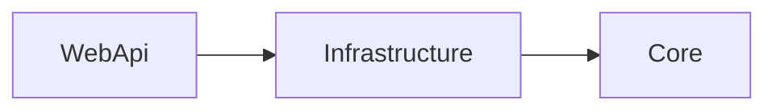

# DEVELOPER.NetWebApi.md

Stand: 2026-05-01

## Zweck

Diese Datei definiert die .NET-spezifischen Entwicklungsregeln fuer Web APIs dieses Repositories. Allgemeine Regeln stehen in `DEVELOPER.md`. Sie gilt fuer fachlich relevante HTTP-APIs mit Routing, Authentifizierung, Validierung, externer Integration, Workflows, Persistenz, Berechnungen und strukturierten API-Antworten.

## Versionsbasis

.NET-Web-API-Anwendungen zielen auf `net10.0`.

Verbindlich sind die Versionen in:

- `global.json`
- `.csproj`
- `Directory.Build.props`
- CI-Konfiguration

`Nullable` ist aktiviert. `ImplicitUsings` ist deaktiviert. File-scoped namespaces sind Standard. Projektweite Namespaces werden ausschliesslich ueber `GlobalUsings.cs` verwaltet.

## Zielbild

.NET-Web-API-Anwendungen bestehen aus genau drei produktiven Projekten innerhalb einer Solution. Testprojekte sind zusaetzlich erlaubt:

- `<Name>.WebApi`
- `<Name>.Infrastructure`
- `<Name>.Core`

Die Referenzrichtung ist verbindlich:

```text
<Name>.WebApi --> <Name>.Infrastructure --> <Name>.Core
```

`Core` ist die fachliche Mitte mit Domain, Use Cases, Ports, Services, Ergebnisobjekten und fachlichen Fehlern. `Infrastructure` implementiert technische Details und Ports aus `Core`. `WebApi` ist Composition Root fuer Host, Konfiguration, DI, Middleware, Routing, HTTP-Endpoints und API-Vertraege.



## Standardstruktur

Die Projektstruktur folgt Domain-Driven Design auf Solution-Ebene. Die drei Hauptprojekte liegen direkt auf oberster Ebene der Solution, nicht unterhalb eines `src/`-Ordners.

```text
<Name>.sln
<Name>.WebApi/
  Program.cs
  GlobalUsings.cs
  Module.cs
  appsettings.json
  Controllers/
  Endpoints/
  Middleware/
  Contracts/
  Filters/
<Name>.Infrastructure/
  GlobalUsings.cs
  Module.cs
  Common/
  Configuration/
  Persistence/
  Serialization/
  <Provider1>/
  <Provider2>/
  <Provider3>/
<Name>.Core/
  GlobalUsings.cs
  Module.cs
  Enums/
  Interfaces/
  Models/
  Services/
  Exceptions/
  Utilities/
tests/
  <Name>.Core.Tests/
  <Name>.Infrastructure.Tests/
  <Name>.WebApi.Tests/
```

| Pfad | Bereich | Zweck |
|---|---|---|
| `<Name>.sln` | Solution | Enthaelt `WebApi`, `Infrastructure`, `Core` sowie passende Testprojekte. |
| `<Name>.WebApi/` | WebApi | Startbares Projekt. Referenziert `Infrastructure`. |
| `<Name>.WebApi/Program.cs` | WebApi | Composition Root fuer Host, Konfiguration, Logging, DI, Middleware und Routing. Keine Fachlogik. |
| `<Name>.WebApi/GlobalUsings.cs` | WebApi | Enthaelt alle globalen `using`-Direktiven des Projekts. |
| `<Name>.WebApi/Module.cs` | WebApi | Enthaelt `AddWebApi(...)` fuer API-spezifische DI-Registrierung. |
| `<Name>.WebApi/appsettings.json` | WebApi | Runtime-Konfiguration fuer Auth, CORS, Provider, Timeouts, Retry, Persistenz und fachliche Settings. Keine Secrets. |
| `<Name>.WebApi/Controllers/` | WebApi | Controller fuer HTTP-Ressourcen, falls Controller genutzt werden. Keine Fachlogik. |
| `<Name>.WebApi/Endpoints/` | WebApi | Minimal-API-Endpoint-Gruppen, falls Minimal APIs genutzt werden. Keine Fachlogik. |
| `<Name>.WebApi/Middleware/` | WebApi | API-nahe Middleware, z. B. Fehlerbehandlung, Correlation IDs oder Request Logging. |
| `<Name>.WebApi/Contracts/` | WebApi | HTTP-Request-/Response-Contracts. Keine Domainmodelle als direkte API-Vertraege. |
| `<Name>.WebApi/Filters/` | WebApi | Endpoint- oder Action-Filter fuer HTTP-nahe Cross-Cutting Concerns. |
| `<Name>.Infrastructure/` | Infrastructure | Technische Implementierungen. Referenziert `Core`, wird von `WebApi` referenziert. |
| `<Name>.Infrastructure/GlobalUsings.cs` | Infrastructure | Enthaelt alle globalen `using`-Direktiven des Projekts. |
| `<Name>.Infrastructure/Module.cs` | Infrastructure | Enthaelt `AddInfrastructure(...)` fuer technische DI-Registrierung. |
| `<Name>.Infrastructure/Common/` | Infrastructure | Enthaelt provideruebergreifende technische Hilfen und Adapterbausteine. |
| `<Name>.Infrastructure/Configuration/` | Infrastructure | Enthaelt typisierte Konfiguration und Validierung technischer Settings. |
| `<Name>.Infrastructure/Persistence/` | Infrastructure | Datenbankzugriff, Repositories, Migrations, Unit-of-Work-nahe Implementierungen und Caches. |
| `<Name>.Infrastructure/Serialization/` | Infrastructure | JSON/XML/CSV-Serialisierung, Parser und Schema-nahe Logik ausserhalb der HTTP-Vertraege. |
| `<Name>.Infrastructure/<Provider1>/` | Infrastructure | Enthaelt die Implementierung eines konkreten Providers oder Fremdsystems. |
| `<Name>.Infrastructure/<Provider2>/` | Infrastructure | Enthaelt die Implementierung eines weiteren Providers oder Fremdsystems. |
| `<Name>.Infrastructure/<Provider3>/` | Infrastructure | Enthaelt die Implementierung eines weiteren Providers oder Fremdsystems. |
| `<Name>.Core/` | Core | Fachliche Mitte. Keine Referenz auf `WebApi` oder `Infrastructure`. |
| `<Name>.Core/GlobalUsings.cs` | Core | Enthaelt alle globalen `using`-Direktiven des Projekts. |
| `<Name>.Core/Module.cs` | Core | Enthaelt `AddCore(...)` fuer fachliche DI-Registrierung. |
| `<Name>.Core/Enums/` | Core | Enthaelt zentrale fachliche Enums. |
| `<Name>.Core/Interfaces/` | Core | Enthaelt Ports, Vertraege und fachliche Schnittstellen. |
| `<Name>.Core/Models/` | Core | Enthaelt fachliche Modelle, DTOs, Value Objects und Ergebnisobjekte. |
| `<Name>.Core/Services/` | Core | Enthaelt fachliche Services, Use Cases und Workflows. |
| `<Name>.Core/Exceptions/` | Core | Enthaelt fachlich erwartbare Fehler. |
| `<Name>.Core/Utilities/` | Core | Enthaelt fachlich neutrale Hilfen im Core-Projekt. |
| `tests/<Name>.Core.Tests/` | Tests | Tests fuer Domain, Use Cases, Workflows, Ports und fachliche Regeln. |
| `tests/<Name>.Infrastructure.Tests/` | Tests | Tests fuer Adapter, Provider, Parser, Retry, Serialisierung, Persistenz und Konfigurationsbindung. |
| `tests/<Name>.WebApi.Tests/` | Tests | Tests fuer Endpoints, Controller, Middleware, Auth, Validierung und DI-Verkabelung. |

## Module.cs und DI

Jedes der drei Hauptprojekte enthaelt eine `Module.cs` als zentralen Einstiegspunkt fuer die DI-Registrierung.

```csharp
public static class Module
{
    public static IServiceCollection AddWebApi(this IServiceCollection services)
    {
        return services;
    }
}
```

Die Methodennamen sind verbindlich:

- `<Name>.WebApi/Module.cs`: `AddWebApi(...)`
- `<Name>.Infrastructure/Module.cs`: `AddInfrastructure(...)`
- `<Name>.Core/Module.cs`: `AddCore(...)`

`Program.cs` darf wegen transitiver Referenzierung alle drei Module explizit registrieren. Die direkte Projektreferenz bleibt `WebApi -> Infrastructure -> Core`.

## Projekt- und Referenzregeln

- `WebApi` referenziert `Infrastructure`; `Infrastructure` referenziert `Core`; `Core` referenziert kein produktives Projekt.
- `WebApi` kennt technische Implementierungen nur ueber DI; Ports liegen in `Core`, Adapter in `Infrastructure`.
- `Core` kennt keine HTTP-Schicht, keinen Host, keinen `HttpClient`, keine Options-Bindings und keinen DI-Container als Laufzeitdetail.

## Domain-Driven-Design-Regeln

- Fachliche Begriffe, Value Objects, Domain Services, Regeln und fachliche Fehler liegen in `Core`.
- Workflows in `Core` orchestrieren Use Cases ueber Ports, verstecken aber keine fachlichen Regeln in langen Ablaufbloecken.
- HTTP-Contracts sind nicht automatisch Domainmodelle; Mapping zwischen API und Core ist explizit.

## WebApi und Bootstrap

- `Program.cs` baut Host, Konfiguration, Logging, DI, Middleware-Pipeline und Routing auf. Fachlogik gehoert nicht nach `Program.cs`.
- Controller oder Minimal-API-Endpoints sind schlank: Request validieren, Use Case aufrufen, Ergebnis in HTTP-Antwort mappen.
- Middleware und Filter behandeln nur HTTP-nahe Cross-Cutting Concerns wie Fehler, Auth, Correlation IDs, Request Logging und CORS.

## HTTP-API-Regeln

- Endpoints sind ressourcen- oder use-case-orientiert benannt und verwenden passende HTTP-Methoden, Statuscodes und Routen.
- Request- und Response-DTOs liegen in `WebApi/Contracts/`; Domain- und Core-Modelle werden nicht direkt als HTTP-Vertrag veroeffentlicht.
- Fehlerantworten sind konsistent, maschinenlesbar und fuer Clients stabil, bevorzugt als Problem-Details-nahe Struktur.

## Core-Regeln

- Use Cases und Workflows haben klare fachliche Namen und liefern explizite Ergebnis- und Statusobjekte.
- Lang laufende Operationen akzeptieren `CancellationToken`, der aus HTTP-Requests weitergereicht wird.
- DTOs enthalten keine rohen Transportobjekte externer APIs und keine HTTP-spezifischen Typen.

## Infrastructure, Provider und externe Dienste

- Externe Dienste, Datenbanken, Caches und Dateisysteme werden ueber Ports aus `Core` angesprochen und in `Infrastructure` implementiert.
- Retry, Timeout, Backoff, Fallback, Persistenz und Konfigurationsbindung liegen in `Infrastructure`.
- Parser und Adapter wandeln Rohdaten an der Grenze in interne Modelle und erhalten relevante Quelleninformationen.

## Auth, Security und CORS

- Authentifizierung, Autorisierung und CORS werden explizit konfiguriert; unsichere Defaults sind nicht erlaubt.
- Secrets werden nicht versioniert, nicht geloggt und nicht in Fehlerantworten ausgegeben.
- Eingaben werden validiert, Ausgaben enthalten keine unbeabsichtigten internen Diagnose- oder Infrastrukturdetails.

## Konfiguration

- Konfiguration wird in `WebApi` geladen und in `Infrastructure` typisiert gebunden und validiert.
- Pflichtkonfiguration scheitert beim Start mit klarer Fehlermeldung.
- `Core` liest keine Konfiguration direkt; fachlich relevante Parameter werden explizit uebergeben.

## Fehler, Logging und Observability

- Fachliche Fehler und Statusmodelle liegen in `Core`; technische Fehler entstehen in `Infrastructure` und werden dort mit Kontext angereichert.
- API-Fehler werden zentral in HTTP-Antworten gemappt; Logs ersetzen keine stabilen Client-Fehlervertraege.
- Correlation IDs, strukturierte Logs und Health Checks sind Standard fuer produktionsnahe Web APIs.

## OpenAPI und API-Versionierung

- Oeffentliche oder teamuebergreifend genutzte APIs dokumentieren Routen, Statuscodes, Request- und Response-Contracts ueber OpenAPI.
- Breaking Changes werden nicht stillschweigend eingefuehrt; API-Versionierung oder klare Migration ist Pflicht.
- Beispiele, Fehlerantworten und Auth-Anforderungen sind Teil der API-Dokumentation, wenn Clients darauf angewiesen sind.

## Code-Regeln

- File-scoped namespaces und `Nullable` sind Standard. `ImplicitUsings` ist deaktiviert. Namespaces werden ueber `GlobalUsings.cs` verwaltet.
- Jeder oeffentliche Typ liegt in einer eigenen Datei; Records sind fuer immutable DTOs, Value Objects und Ergebnisobjekte bevorzugt.
- Keine rohen API-DTOs in `Core`; keine Domainmodelle als direkte HTTP-Response-Contracts.

## Unit Tests, Integrationstests und API-Tests

- Fachliche Regeln und Workflows werden in `Core.Tests` mit Fake-Ports und kontrollierten Testdaten abgesichert.
- Infrastrukturtests pruefen Adapter, Provider, Parser, Retry, Persistenz, Serialisierung und Konfigurationsbindung ohne instabile Live-Dienste.
- WebApi-Tests pruefen Routing, Statuscodes, Auth, Validierung, Fehlerantworten, OpenAPI-relevante Contracts und DI-Verkabelung deterministisch.
