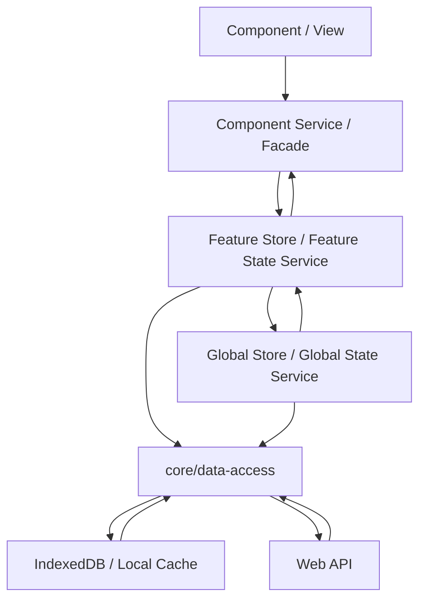

# DEVELOPER.Angular.md

Stand: 2026-08-05

## Zweck

Diese Datei gilt für Angular-Anwendungen und Angular-nahe Frontend-Teile. Zugehörige allgemeine, HTML-, CSS- und TypeScript-Regeln werden über [ROLES.md](https://heljens-it-services.github.io/agent-files/roles/ROLES.md) aufgelöst.

## Zielbild

Angular-Anwendungen werden als reaktive, modulare Anwendungen gebaut. Components zeigen Daten an und senden Nutzerintentionen; fachlicher Zustand, Datenzugriff, lokale Persistenz und Hintergrundarbeit liegen außerhalb der Components.



## Begriffe und Grenzen

[MUST] Components und Views sind für Darstellung, Nutzerinteraktion und lokalen Template-Zustand verantwortlich.

[ALLOW] Components dürfen Inputs lesen, Outputs senden, lokale UI-Signals halten, View-Modelle anzeigen und Methoden einer Facade oder eines Component Service aufrufen.

[MUST_NOT] Components dürfen keine fachlichen Workflows, HTTP-Zugriffe, Persistenzzugriffe, DTO-Mappings, globale State-Änderungen oder Worker-Aufgaben direkt ausführen.

[MUST] Eine Facade oder ein Component Service ist die direkte Schnittstelle zwischen View und fachlichem Ablauf eines Features.

[MUST] Bestehende Projektkonventionen müssen bestimmen, ob diese Schicht als Facade, Component Service, Feature Service oder Use Case benannt wird.

[MUST] Facades oder Component Services müssen Nutzeraktionen aus der View in klar benannte Operationen übersetzen, z. B. `saveDraft`, `loadDetails`, `confirmSelection` oder `refresh`.

[ALLOW] Facades oder Component Services dürfen View-nahe Koordination enthalten, z. B. Laden, Speichern, Fehlerabbildung, Navigation nach erfolgreicher Aktion oder Zusammenbau eines View-Models.

[MUST_NOT] Facades oder Component Services dürfen technische Details wie konkrete HTTP-Endpunkte, IndexedDB-Stores oder Storage-Schlüssel nicht offenlegen.

[MUST] Ein Feature Store oder Feature State Service hält den Zustand eines fachlichen Features.

[MUST] Feature State muss über readonly Signals, computed Values oder klar benannte Selector-Methoden lesbar sein.

[MUST] Feature State darf nur über explizite Methoden geändert werden, z. B. `load`, `setFilter`, `markDirty`, `applyServerResult` oder `reset`.

[MUST_NOT] Feature Stores dürfen keine Template-spezifischen Layout- oder Anzeigeentscheidungen enthalten.

[MUST] Ein Global Store oder Global State Service muss auf app-weiten Zustand beschränkt bleiben, der von mehreren Features benötigt wird, z. B. angemeldeter Nutzer, Berechtigungen, Mandant, Sprache, Online-Status oder globale Konfiguration.

[MUST_NOT] Feature-spezifischer Zustand darf nicht in globalen State verschoben werden, nur weil mehrere Komponenten desselben Features ihn brauchen.

[MUST] Data-Access Services kapseln technische Kommunikation mit externen Systemen, z. B. HTTP APIs.

[MUST] Data-Access Services müssen DTOs, Request-Parameter, technische Fehler und Transportdetails an der Systemgrenze behandeln.

[MUST_NOT] Data-Access Services dürfen keine UI-Zustände wie `selected`, `expanded`, `editing` oder `visible` modellieren.

[MUST] Repository- oder Adapter-Services kapseln lokale Persistenz wie IndexedDB, LocalStorage oder Cache-Schichten.

[ALLOW] Repository- oder Adapter-Services dürfen Speicherformat, Keys, Versionierung und Migration kennen.

[MUST_NOT] Repository- oder Adapter-Services dürfen nicht entscheiden, welche Nutzeraktion fachlich erlaubt ist.

[MUST] Worker-Services kapseln Hintergrundarbeit und stellen eine abbrechbare, klar benannte API bereit.

[MUST_NOT_IF] Worker-Aufrufe dürfen nicht direkt aus Components gestartet werden, wenn sie fachlichen Zustand, Persistenz oder API-Kommunikation beeinflussen.

## Standardstruktur

[SHOULD] Angular-Projekte sollen der folgenden Struktur folgen. Abweichungen sind erlaubt, wenn ein bestehendes Projekt eine andere stabile Struktur vorgibt und die konkrete Aufgabe keine Strukturmigration ist.

```text
src/app/
  core/
    auth/
    config/
    data-access/
    enums/
    guards/
    interfaces/
    layout/
    models/
    resolvers/
    services/
    store/
    util/
  shared/
    ui/
    util/
    pipes/
  features/
    <feature>/
      page/
      components/
        <component-name>/
      models/
      services/
      store/
      util/
  app.routes.ts
  app.config.ts
```

[MUST] `src/app/core/` muss Singleton-nahe Infrastruktur wie Auth, Konfiguration, globale Services, State und Layout enthalten.

[MUST] `src/app/shared/` muss wiederverwendbare, fachlich neutrale UI-Bausteine und Hilfen enthalten.

[MUST] `src/app/features/` muss fachliche Features enthalten.

[MUST] Feature-Ordner müssen UI, Logik und lokale Modelle eines Features kapseln.

[MUST] Jedes Feature muss genau eine fachliche Hauptkomponente unter `<feature>/page/` enthalten. Diese Komponente repräsentiert den primären Einstiegspunkt des Features.

[SHOULD] Die Hauptkomponente des Features soll bevorzugt per Route angesteuert werden.

[MUST] Hilfskomponenten, Teilansichten und Subkomponenten eines Features müssen unter `<feature>/components/` liegen.

[MUST] Feature-Komponenten unter `<feature>/components/` müssen jeweils in einem eigenen Ordner nach dem Schema `<feature>/components/<component-name>/` organisiert werden.

[MUST] `src/app/app.routes.ts` muss die Routen der Anwendung definieren.

[MUST] `src/app/app.config.ts` muss Bootstrap und globale Provider definieren.

[SHOULD] Standalone Components, `app.config.ts` und funktionale Provider sollen verwendet werden. Abweichungen sind erlaubt, wenn Legacy-Integration oder Bibliotheken `NgModule` erfordern.

## Templates und Component-Markup

[MUST] Komplexe Angular-Template-Ausdrücke müssen in `computed`, readonly Properties oder View-Modelle ausgelagert werden.

[MUST_NOT] Methodenaufrufe im Template dürfen keine Seiteneffekte, Datenzugriffe, Mutationen, teuren Berechnungen oder asynchronen Operationen auslösen.

[SHOULD] Mehrfach verschachtelte `@if`, `@for` oder `ng-template`-Strukturen sollen durch kleinere Presentational Components, benannte computed Values oder View-Modelle vereinfacht werden.

[MUST] Listen müssen stabile fachliche `track`-Ausdrücke verwenden.

[MUST_NOT_IF] Array-Index darf nicht als `track` verwendet werden, wenn fachliche IDs oder stabile Schlüssel verfügbar sind.

## UI-Änderungen durch Agents

[MUST] Vor neuen Komponenten, Klassen oder Utilities muss geprüft werden, ob im Projekt bereits ein passendes Pattern existiert.

[MUST_IF] Wenn ein UI-Problem durch ein gemeinsames Pattern verursacht wird oder mehrfach vorkommt, muss die gemeinsame Stelle angepasst oder die lokale Ausnahme im Arbeitsabschluss begründet werden.

[MUST_IF] Screenshots, Storybook, Playwright oder vergleichbare visuelle Checks müssen genutzt werden, wenn Angular-UI-Änderungen Layout, Responsiveness, Accessibility oder sichtbare Nutzerflows betreffen und diese Werkzeuge im Projekt verfügbar sind.

## State-Regeln

[SHOULD] Signals sollen für synchronen UI-State verwendet werden. Abweichungen sind erlaubt, wenn Angular APIs oder externe Bibliotheken Observables vorgeben oder erwarten.

[MUST] Abgeleiteter Signal-State muss berechnet werden und darf nicht redundant gespeichert werden.

[MUST_NOT] RxJS darf nicht als Anwendungs-State- oder Datenfluss-Primitive verwendet werden.

[ALLOW_IF] Angular-/RxJS-Interop darf genutzt werden, wenn Angular APIs oder externe Bibliotheken Observables vorgeben oder erwarten.

## Lokale Daten und Offline-Fähigkeit

[MUST] Offline- und Sync-Zustände müssen explizit modelliert werden, z. B. `idle`, `loading`, `synced`, `dirty`, `conflict`, `failed`.

[MUST_IF] Nach einem Datenquellenausfall angezeigte Cache- oder zuletzt bekannte Daten müssen für Nutzer als offline oder veraltet gekennzeichnet sein.

[MUST_IF] Cache-Invalidierung, TTL, Konfliktlösung und manuelles Refresh-Verhalten müssen fachlich geregelt und getestet werden, wenn lokale Daten oder Offline-Fähigkeit Teil des Tasks sind.

## Web API und Worker

[MUST] HTTP-Zugriff muss in `core/data-access/` liegen.

[SHOULD] Für einmalige HTTP Requests soll `Promise<T>` oder `Promise` verwendet werden.

[ALLOW_IF] `Observable` darf für HTTP Requests verwendet werden, wenn Angular APIs, Interceptors, Cancellation, Progress Events, Streams oder externe Bibliotheken dies vorgeben oder fachlich sinnvoll machen.

[MUST] DTOs müssen an der Grenze in fachliche View- oder Domain-Modelle gemappt werden.

[MUST_IF] Wenn der Ausfall eines notwendigen HTTP-Requests einen Nutzerablauf betrifft, muss der Feature State einen expliziten Fehlerzustand abbilden und die UI ihn verständlich darstellen.

[MUST_IF] Interceptors müssen Auth, Correlation IDs, Retry für idempotente Requests und technische Fehlerklassen behandeln, wenn diese Querschnittsthemen im Projekt benötigt werden.

[MUST] Cancellation muss für Requests, Worker-Jobs und längere Streams vorgesehen werden.

## Forms und Validierung

[SHOULD] Signal Forms sollen verwendet werden, wenn die verwendete Angular-Version und das Projektsetup sie ohne experimentelle Flags, bekannte Blocker oder inkompatible Bibliotheken unterstützen.

[MUST] Geteilte fachliche Formularvalidierung muss wiederverwendbar außerhalb der Component liegen, z. B. in `shared/util`.

[MUST] Formularzustände wie `dirty`, `pending`, `invalid`, `saving` und `saved` müssen explizit behandelt werden.

## Unit Tests und E2E

[MUST_IF] Unit Tests müssen Stores, Services, Guards, Resolver, Pipes und fachliche Hilfsfunktionen absichern, wenn diese im Task geändert oder neu erstellt werden.

[MUST_IF] Tests geänderter oder neuer Datenladevorgänge müssen nachweisen, dass Request-Fehler den vorgesehenen Fehlerzustand statt eines erfolgreichen leeren Zustands auslösen.

[SHOULD] E2E-Tests sollen mit Playwright kritische Nutzerflüsse abdecken. Abweichungen sind erlaubt, wenn das Projekt einen anderen E2E-Runner vorgibt oder der Task keinen sichtbaren Nutzerflow betrifft.

[SHOULD] Playwright-Tests sollen nutzerorientierte Selektoren wie `getByRole`, `getByLabel` und `getByText` verwenden.

[ALLOW_IF] `data-testid` darf eingesetzt werden, wenn semantische Selektoren nicht robust genug sind.

[MUST_NOT] Feste Wartezeiten wie `waitForTimeout` dürfen nicht verwendet werden.

## Qualität und Code

[MUST_NOT] Zirkuläre Feature-Abhängigkeiten dürfen nicht eingeführt werden.
